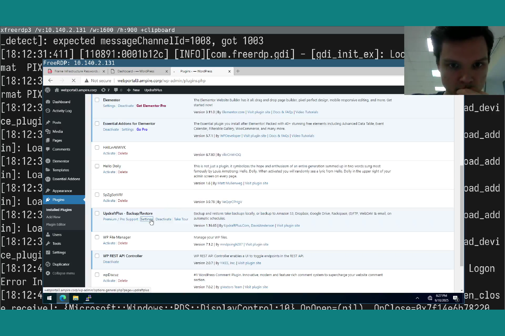

---
## Front matter
lang: ru-RU
title: Лабораторная работа №1
subtitle: "Кибербезопасность предприятия"
author:

  - НКНбд-01-22;
  - Аристид Жан,
  - Акопян Сатеник,
  - Кадров Виктор,
  - Нве Манге Хосе Херсон Мико,
  - Эспиноса Висилита Кристина Микаела,
  
  - НПИбд-01-22;
  - Стариков Данила,

  - НФИбд-02-22;
  - Чемоданова Ангелина

## i18n babel
babel-lang: russian
babel-otherlangs: english

## Formatting pdf
toc: false
toc-title: Содержание
slide_level: 2
aspectratio: 169
section-titles: true
theme: metropolis
header-includes:
 - \metroset{progressbar=frametitle,sectionpage=progressbar,numbering=fraction}
---

## Цель работы

Основная цель данной лабораторной работы заключается в выполнении тренировки “Защита корпоративного мессенджера” в роли команды “Blue Team” (CSIRT — Computer Security Incident Response Team). В процессе выполнения работы необходимо освоить практические навыки выявления, анализа и устранения уязвимостей в корпоративной инфраструктуре, а также освоить навыки отработки действий по нейтрализации последствий успешных атак.

## Теоретическое введение. Легенда "Защита корпоративного мессенджера"

Конкуренты решили скомпрометировать деятельность Компании и нашли для этого исполнителя. Злоумышленник находит в Интернете сайт соответствующего предприятия и решает провести атаку на него с целью получения доступа к внутренним ресурсам.  

Проэксплуатировав обнаруженную на сайте уязвимость, нарушитель стремится захватить управление другими ресурсами защищаемой сети, в том числе, пытается закрепиться на почтовом сервере и продолжить атаку.

Главная задача злоумышленника - получение доступа к переписке сотрудников компании, раскрытие учётных данных пользователей, 
зарегистрированных в приложении корпоративного мессенджера, с целью использования их для нанесения ущерба репутации конкурирующей 
Компании. 

Квалификация нарушителя высокая. Он умеет использовать инструментарий для проведения атак, а также знает техники постэксплуатации.

## Теоретическое введение. Пояснения уязвимостей

Уязвимости:

- WordPress-wpDiscuz (CVE-2020-24186)
- Proxylogon (CVE 2020-26855, CVE 2021-27065)
- Rocket.Chat (CVE-2021-22911, CVE-2022-0847)

## Теоретическое введение. Атака на CMS WordPress-wpDiscuz

WpDiscuz– один из плагинов CMS WordPress для создания комментариев на базе Ajax.

Вверсиях с 7.0.0 по 7.0.4 включительно существует уязвимость File Upload(CVE-2020-24186), которая позволяет получить RCE, если прикрепить любой файл(например, код на php) в поле для комментариев и загрузить на сервер. Данный процесс можно выполнить без аутентификации. После создания файла с полезной нагрузкой нарушитель будет производить POST-запрос с определенными параметрами по ссылке 
http://webportal3.ampire.corp/index.php/wp-admin/admin-ajax.php для загрузки файла.

Факт загрузки будет детектироваться в журнале активности в WordPress, в котором записывается хронологическая запись последовательности изменений и действий.

## Теоретическое введение. Атака на почтовый сервер(ProxyLogon)

Уязвимость ProxyLogon (CVE 2020-26855 (Server-Side Request Forgery)) представляет собой SSRF в Exchange Server, позволяющую обойти аутентификацию и выдать себя за администратора. В сценарии данная уязвимость используется в связке с CVE2021-27065(запись файла в произвольную директорию).

SSRF - подделка запроса на стороне сервера – это атака, которая позволяет отправлять запросы от имени сервера к внешним или внутренним ресурсам.

При  помощи ProxyLogon атакующий может выдать себя, например, за администратора и аутентифицироваться в панели управления Exchange(ECP), после чего перезаписать любой файл в системе при помощи CVE-2021-27065.

Уязвимости ProxyLogon подвержены все Exchange Server 2016 до версии 15.01.2106.013.

## Теоретическое введение. Атака на RocketChat

Уязвимость CVE-2021-22911 представляет собой сочетание из двух SQL инъекций:

- слепая NoSQL-инъекция (позволяет украсть токен сброса пароля пользователя);
- NoSQL-инъекция№2:повышение привилегий.

Уязвимость CVE-2022-0847 (Dirty Pipe) представляет собой уязвимость повышения привилегий,находящуюся в самом ядре Linux версии 5.8 и выше.

## Выполнение лабораторной работы. Атака на CMS WordPress-wpDiscuz

Для начала перейдем в ViPNet IDS NS, отфильтруем события и обнаружим акату на CMS WordPress.

{#fig:001 width=70%}

## Выполнение лабораторной работы. Атака на CMS WordPress-wpDiscuz

Проанализировав события, поймем, что перед нами уязвимость CVE-2020-24186. Получим дополнительную информацию об этой уязвимости.

{#fig:002 width=70%}

## Выполнение лабораторной работы. Атака на CMS WordPress-wpDiscuz

Через ViPNet IDS NS выявим критические события на почтовом сервере MS Exchange, заметим загрузку подозрительных файлов с использованием фреймворка Matesploit.

## Выполнение лабораторной работы. Атака на CMS WordPress-wpDiscuz

Откроем SecInoin, увидим подозрительный http-запрос и ответ сервера, изучим полученный пакет и найдем там ипользование WinAPI-функций, а также байтовый массив для инжектирования кода в память.

{#fig:003 width=90%}

## Выполнение лабораторной работы. Атака на CMS WordPress-wpDiscuz

Мы можем прийти к выводам по технике атаки:

  - Доставка: через http-запрос к скрипту; 
  - Выполнение: Инжектирование кода в память через VirtualAlloc + CreateThread; 
  - Цель: Обход антивируса(без записи на диск)

и по индикаторам компрометации(IoC):

  - IP-адрес: 195.239.174.11; 
  - Порт: 8010/TCP; Хэш(SHA-256): Не вычислен(требуется анализ файла); 
  - Сигнатура кода: Использование VirtualAlloc + шелл-код

## Выполнение лабораторной работы. Атака на CMS WordPress-wpDiscuz

Атака оканчивается загрузкой бинарного файла в формате ELF, который, вероятно, содержит вредоносный код или эксплойт на узел 10.10.2.22.

{#fig:004 width=90%}

## Выполнение лабораторной работы. Атака на CMS WordPress-wpDiscuz

{#fig:005 width=70%}

## Выполнение лабораторной работы. Устранение последствия Deface веб-интерфейса

Если открыть страницу сайта компании, указать в строке браузера IP-адрес 10.10.1.22 (http://webportal3.ampire.corp), то можно заметить, что блог после атаки выглядит следующим образом: до использования полезной нагрузки на странице сайта красный крупнотоннажный грузовой автомобиль и после использования полезной нагрузки картинка "hacked".

На веб-сервере работает ftp-сервер vsftpd, который дает возможность плагину Updraft сохранять и скачивать backup. Таким образом, можно выполнить backup-восстановление из последнего файла. 

Для нейтрализации данной полезной нагрузки необходимо сформировать резервную копию с помощью плагина Updraft Backup/Restore.

## Выполнение лабораторной работы. Устранение последствия Deface веб-интерфейса

Этапы восстановления: 

- в панели управления на странице Plugins найти плагин резервного восстановления UpdraftPlus, открыть настройки.
- для восстановления нажать Restore на последней резервной копии.

## Выполнение лабораторной работы. Устранение последствия Deface веб-интерфейса

{#fig:006 width=70%}

## Выполнение лабораторной работы. Устранение последствия Deface веб-интерфейса

{#fig:007 width=70%}

## Выполнение лабораторной работы. Устранение последствия Deface веб-интерфейса

В выпадающем окне выбора компонентов для восстановления выбрать только "Themes" и "Uploads".

{#fig:008 width=70%}

## Выполнение лабораторной работы. Устранение последствия Deface веб-интерфейса

{#fig:009 width=80%}

## Выполнение лабораторной работы. Устранение уязвимости

Закрытие уязвимости можно осуществить несколькими способами:

- отклонение плагина WpDiscuz;
- обновление версии WpDiscuz до версии 7.0.5 ии выше(при наличии интернета).

Для отключения плагина в левой части панели инструментов необходимо открыть раздел Plugins, далее нажать на опцию Deactivate. Также можно полностью удалить плагин с сайта аналогичным образом с помощью опции Delete.

## Выполнение лабораторной работы. Устранение уязвимости

{#fig:010 width=85%}

## Выполнение лабораторной работы. Устранение последствия Meterpreter-сессия

Также необходимо закрыть активные сессии с атакующим. 

Для обнаружения meterpreter-сессии необходимо проверить сокеты уязвимой машины на подключение к определенному порту машины нарушителя с помощью утилиты ss. Просмотреть сокеты только нужного протокола TCP и отфильтровать данные (например, вывести только активные TCP-соединения) можно с помощью команды: ss -tnp.

## Выполнение лабораторной работы. Устранение последствия Meterpreter-сессия

{#fig:011 width=85%}

## Выполнение лабораторной работы. Устранение последствия Meterpreter-сессия

Для закрытия вредоносного сокета необходимо завершить процесс,  использующийся для поддержания соединения. При завершении процесса определить уникальный идентификатор процесса (PID) и прописать команду kill с соответствующими параметрами.

## Выполнение лабораторной работы. Устранение последствия Meterpreter-сессия

{#fig:012 width=90%}

## Выполнение лабораторной работы. Устранение последствия Meterpreter-сессия

{#fig:013 width=90%}

## Выполнение лабораторной работы. Атака на почтовый сервер(ProxyLogon). Обнаружение CVE 2021-26855 (SSRF) средствами ViPNet IDS NS

Proxylogon представляет собой SSRF в Exchange Server, позволяющую обойти аутентификацию и выдать себя за администратора. В сценарии данная уязвимость используется в связке с CVE 2021-27065 (запись файла в произвольную директорию). Уязвимости Proxylogon подвержены все Exchange Server 2016, до версии 15.01.2106.013.  

Сетевой сенсор ViPNet IDS NS во время атаки детектирует несколько событий, которые потенциально могут быть связаны с эксплуатацией уязвимости на уязвимом хосте.
В списке событий присутствуют признаки загрузки на уязвимый хост подозрительных файлов в формате .exe. 

Также зафиксирована активность вредоносного программного обеспечения Metasploit.

## Выполнение лабораторной работы. Атака на почтовый сервер(ProxyLogon). Обнаружение CVE 2021-26855 (SSRF) средствами ViPNet IDS NS

{#fig:014 width=80%}

## Выполнение лабораторной работы. Атака на почтовый сервер(ProxyLogon). Обнаружение средствами Security Onion

Для обнаружения последствий эксплуатации в Security Onion следует использовать утилиту Squert – визуальный инструмент, предоставляющий дополнительный контекст для событий с помощью метаданных. Для просмотра данных о событиях нужно открыть ссылку на веб-приложение 
Squert на главной странице Security Onion. 

На скриншоте представлены события, зафиксированные  веб-приложением Squert. Данные события аналогичны событиям, зафиксированным сетевым сенсором ViPNet IDS NS. 

## Выполнение лабораторной работы. Атака на почтовый сервер(ProxyLogon). Обнаружение средствами Security Onion

{#fig:015 width=65%}

## Выполнение лабораторной работы. Атака на почтовый сервер(ProxyLogon). Обнаружение средствами Security Onion

{#fig:016 width=70%}

## Выполнение лабораторной работы. Устранение уязвимости ProxyLogon

Во время эксплуатации уязвимости Proxylogon нарушитель совершает GET и POST запросы к /ecp. Достаточно ограничить доступ к вышеуказанной директории чтобы уязвимость не эксплуатировалась.

Открыть Internet Information Services (IIS) Manager. Для этого необходимо нажать сочетание клавиш «Win+R», ввести «inetmgr» и нажать «Enter». В открывшемся окне перейти во вкладку MAIL/Sites/Default Web Site/ecp и нажать на IP Address and Domain Restrictions. Далее в «Edit Feature Settings» – «Access for unspecified clients» выбрать пункт «Deny» и нажать «OK».

## Выполнение лабораторной работы. Устранение уязвимости ProxyLogon

{#fig:017 width=85%}

## Выполнение лабораторной работы. Устранение уязвимости ProxyLogon

{#fig:018 width=85%}

## Выполнение лабораторной работы. Устранение последствия China Chopper

Backdoor "China Chopper" можно найти в очевидной для таких атак директории С:/Program Files/Microsoft/Exchange Server/V15/FrontEnd/HttpProxy/owa/auth/AM_backdoor.aspx. Большинство POC (проверок концепций) эксплуатации уязвимости Proxylogon записывают файл именно по данному адресу, что выполняется для доступа backdoor(backdoor — «чёрный ход», дословно «задняя дверь» — уязвимость, которая даёт несанкционированный доступ к компьютеру, смартфону и т. п..) без авторизации из веб-директории owa/auth. При необходимости последствие можно записать в другую директорию.

Для устранения последствия необходимо: 
- удалить файл веб-оболочки по пути С:/ProgramFiles/Microsoft/Exchange Server/V15/FrontEnd/HttpProxy/../auth/;

## Выполнение лабораторной работы. Устранение последствия China Chopper

{#fig:019 width=85%}

## Выполнение лабораторной работы. Атака на RocketChat (CVE-2021-22911)

Признак эксплуатации NoSQL-инъекции - это невозможность осуществления входа на веб-интерфейс под учетными данными администратора (логин: admin@rocket-local.com, пароль: qwe123!@#). В syslog пишутся следующие строчки: 

- ошибка отправки приветственного сообщения при регистрации нового аккаунта; 
- письмо для сброса пароля админа; 
- ошибки при выполнении сценариев WebHook. 

## Выполнение лабораторной работы. Атака на RocketChat (CVE-2021-22911)

{#fig:020 width=90%}

## Выполнение лабораторной работы. Атака на RocketChat (CVE-2021-22911)

{#fig:021 width=90%}

## Выполнение лабораторной работы. Атака на RocketChat (CVE-2021-22911)

{#fig:022 width=90%}

## Выполнение лабораторной работы. Атака на RocketChat (CVE-2021-22911)

{#fig:023 width=70%}

## Выполнение лабораторной работы. Закрытие уязвимости RocketChat

Так как NoSQL-инъекция для повышения привилегий использует высокоуровневый оператор БД $where, временной, смягчающей мерой, может стать отключение выполнения JavaScript на стороне сервера базы данных.

Для этого необходимо отредактировать файл конфигурации БД /etc/mongod.conf, добавив строчку javascriptEnabled: false.

## Выполнение лабораторной работы. Закрытие уязвимости RocketChat

{#fig:024 width=85%}

## Выполнение лабораторной работы. Закрытие уязвимости RocketChat

{#fig:025 width=85%}

## Выполнение лабораторной работы. Закрытие уязвимости и последствия

Для применения настроек необходимо перезапустить службу: sudo systemctl restart mongod.service.

{#fig:026 width=70%}

## Выполнение лабораторной работы. Закрытие уязвимости и последствия

Данное последствие можно обнаружить при выводе сетевой статистики с помощью утилиты ss и параметрами –tp (позволяет просматривать сведения по TCP-соединениям, список процессов в данный момент). В случае установления соединения, на уязвимой машине появится сокет с машиной нарушителя.

Нейтрализовать meterpreter-сессию также можно при помощи утилиты ss с ключом –K, чтобы завершить все сессии с машиной нарушителя необходимо ввести: sudo ss –K dst HACKER_IP dport = HACKER_PORT. 

## Выполнение лабораторной работы. Закрытие уязвимости и последствия

{#fig:027 width=85%}

## Вывод

В ходе выполнения данной лабораторной работы мы выполнили тренировку “Защита корпоративного мессенджера” в роли команды “Blue Team” (CSIRT — Computer Security Incident Response Team). В процессе выполнения работы освоили практические навыки выявления, анализа и устранения уязвимостей в корпоративной инфраструктуре, а также освоили навыки отработки действий по нейтрализации последствий успешных атак.
