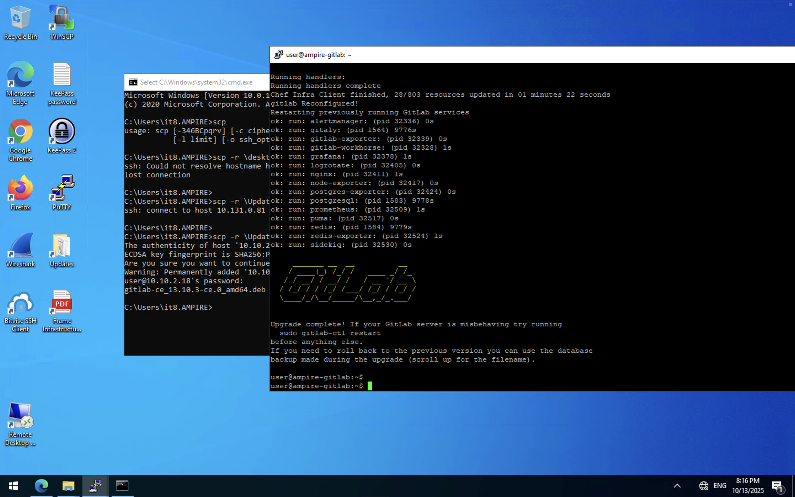
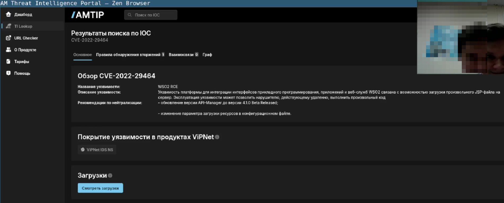

---
## Front matter
lang: ru-RU
title: Лабораторная работа №2
subtitle: "Кибербезопасность предприятия"
author:

  - НКНбд-01-22;
  - Аристид Жан,
  - Акопян Сатеник,
  - Кадров Виктор,
  - Нве Манге Хосе Херсон Мико,
  - Эспиноса Висилита Кристина Микаела,
  
  - НПИбд-01-22;
  - Стариков Данила,

  - НФИбд-02-22;
  - Чемоданова Ангелина

## i18n babel
babel-lang: russian
babel-otherlangs: english

## Formatting pdf
toc: false
toc-title: Содержание
slide_level: 2
aspectratio: 169
section-titles: true
theme: metropolis
header-includes:
 - \metroset{progressbar=frametitle,sectionpage=progressbar,numbering=fraction}
---

## Цель работы

Основная цель данной лабораторной работы заключается в выполнении тренировки “Защита интеграционной платформы” в роли команды “Blue Team” (CSIRT — Computer Security Incident Response Team). В процессе выполнения работы необходимо освоить практические навыки выявления, анализа и устранения уязвимостей в различных системах, а также освоить навыки отработки действий по нейтрализации последствий успешных атак.

## Легенда "Защита интеграционной платформы"

Конкуренты решили нанести репутационный вред деятельности компании и для этого нашли исполнителя. Злоумышленник находит в Интернете сайт соответствующей организации и решает провести атаку на него с целью получения доступа к внутренним ресурсам.  

Проэксплуатировав обнаруженную на сайте уязвимость, нарушитель наносит ущерб работе и репутации владельца сайта, блокирует доступ к нему и стремится захватить управление над другими ресурсами защищаемой сети. В ходе вектора атаки злоумышленник, используя уязвимость при загрузке определенных файлов в репозиторий, закрепился на узле GitLab и продолжил своё перемещение внутри периметра. 

## Легенда "Защита интеграционной платформы"

Далее злоумышленник успешно подключается к платформе, предназначенной для создания и управления API, с целью получения доступа к внутренним данным компании, раскрытие которых может привести к серьезным репутационным и финансовым потерям. 

Квалификация нарушителя высокая. Он умеет использовать инструментарий для проведения атак, а также знает техники постэксплуатации.

## Пояснения уязвимостей

Уязвимости и последствия:

- Bitrix vote RCE (CVE-2022-27228) -> Deface
- GitLab RCE (CVE-2021-22204, CVE-2021-22205) -> Meterpreter
- WSO2 API-Manager RCE (CVE-2022-29464) -> WSO2 User web

## Атака на Bitrix(Описание уязвимости CVE-2022-27228)

Эксплуатация уязвимости позволяет удаленному нарушителю записать произвольные файлы в систему с помощью отправки специально сформированных сетевых пакетов. Данная уязвимость присутствует в модуле vote CMS Bitrix до версии 22.0.400. 

На текущий момент выявлено два вектора использования нарушителем 
зараженных веб-сайтов: 

1) после эксплуатации уязвимости нарушитель загружает на веб-сайт модифицированный файл /bitrix/modules/main/include/prolog.php, в который добавляется строка https://techmestore[.]pw/jquerydiui.js., вызывающая сторонний JS-скрипт. Скрипт jquery-ui.js проверяет, что переход пользователя на зараженный сайт осуществлен из поисковой системы и впервые за день. При совпадении условий открывается адрес otrasoper[.]ga/help/?23211651614614, который осуществляет перенаправление пользователей из российского сегмента сети Интернет на фишинговые сайты различных маркетплейсов; 

## Атака на Bitrix(Описание уязвимости CVE-2022-27228)

2) при посещении пользователем зараженного веб-сайта под управлением CMS Bitrix в кеш браузера пользователя внедряется JS-скрипт, который загружается из различных директорий веб-сайта: 

- bitrix/js/main/core/core.js?1656612291497726; 
- bitrix/js/main/core/core.js?1656598434497824; 
- bitrix/templates/cm_main/js/jquery-1.10.2.min.js.

Данные действия позволяют нарушителю перенаправить пользователя на сторонние вредоносные ресурсы. 

## Атака на GitLab(Описание уязвимости)

GitLab – это инструмент, предназначенный для хранения, управления и совместной разработки веб-проектов с использованием системы контроля версий Git. Данный инструмент обеспечивает командам разработчиков удобный способ совместной работы, позволяя им эффективно управлять кодом, выполнять обновления и откатывать изменения при необходимости. 

Используемый на платформе сервер GitLab версии 13.10.2 содержит критическую уязвимость CVE-2021-22204, которая позволяет получить RCE при загрузке определенных файлов в репозиторий. Уязвимость заключается в том, что при загрузке файлов с расширением JPG, jpeg, tiff, модуль GitLab Workhorse передает файлы в библиотеку ExifTool, которая удаляет из них метаданные.

## Атака на GitLab(Описание уязвимости)

Библиотека ExifTool различает файлы не по расширению, а по их контенту и подбирает соответствующий фильтр. Для эксплуатации уязвимости нарушитель создает и загружает в репозиторий определенный DJVU-файл с расширением JPG. Далее модуль GitLab Workhorse передает данный файл в библиотеку ExifTool, которая при попытке преобразовать escape-последовательности для создания токенов при автоматизированном сборе обращается к функции eval. Созданный нарушителем DJVU-файл в своих метаданных будет содержать нужный код, который исполнит функция eval. 

Критическая уязвимость библиотеки для обработки метаданных позволяет получить удаленное выполнение кода, при загрузке авторизированным пользователем определенного файла с расширением JPG.

## Атака на WSO2 API-Manager

Уязвимость платформы для интеграции интерфейсов прикладного программирования, приложений и веб-служб WSO2 связана с возможностью загрузки произвольного JSP-файла на сервер. Эксплуатация уязвимости может позволить нарушителю, действующему удаленно, выполнить произвольный код. 

## Атака на Bitrix

Во время атаки сетевой сенсор ViPNet IDS NS детектирует большое 
количество событий информационной безопасности.

{#fig:001 width=60%}

## Атака на Bitrix

При просмотре записей журнала событий обнаружено, что IP-адрес: 

- 195.239.174.11 – принадлежит машине атакующего; 
- 10.10.1.33 – принадлежит уязвимому серверу Bitrix. 

Среди записей журнала зарегистрированы события информационной 
безопасности высокой важности: 

1) внедрение полезной нагрузки в HTTP-запросе 
2) PHP-скрипт с кодом для произвольного удаленного выполнения команд; 
3) информирование о скачивании исполняемого файла с машины нарушителя. 

## Атака на Bitrix

{#fig:002 width=80%}

## Атака на Bitrix

{#fig:003 width=80%}

## Атака на Bitrix

{#fig:004 width=80%}

## Обнаружение средствами Security Onion

Для обнаружения последствий эксплуатации с помощью Security Onion следует использовать утилиту Squert – визуальный инструмент, предоставляющий дополнительный контекст для событий с помощью метаданных. В веб-интерфейсе Squert идентифицированных событий.

{#fig:005 width=90%}

## Обнаружение средствами Security Onion

{#fig:006 width=90%}

Обращение к модулю vote и вызов функции CFileUploader. В поле Content-Disposition передается имя файла payload2.phar и обнаружено содержимое данного файла, в котором присутствует команда на скачивание php-файла с веб-сервера злоумышленника в базовую директорию веб-сервера Bitrix /var/www/html.

## Уязвимость CVE-2022-27228

{#fig:007 width=90%}

## Обнаружение средствами ОС

{#fig:008 width=90%}

## Атака на Bitrix

{#fig:009 width=80%}

## Устранение последствия Meterpreter-сессия

Цель данной полезной нагрузки – получение нарушителем Meterpreter-сессии с уязвимым сервером. 

Обнаружить данную полезную нагрузку можно с помощью утилиты ss с ключами t и p. В случае установления соединения на уязвимой машине появится сокет с машиной нарушителя.

В Linux у процесса имеется уникальный идентификатор PID. При создании каждому процессу автоматически присваивается PID. Для прерывания соединения с машиной нарушителя необходимо принудительно остановить процесс с помощью команды kill вместе с номером процесса. 

## Устранение последствия Meterpreter-сессия

Для устранения данной полезной нагрузки необходимо: 

1) выполнить команду ss -tp для обнаружения активных соединений; 
2) с помощью команды sudo kill <PID> завершить процесс, устанавливающий соединение с хостом нарушителя.

{#fig:010 width=90%}

## Устранение последствия Meterpreter-сессия

{#fig:011 width=80%}

Данная полезная нагрузка нацелена на подрыв репутации компании путем изменения главной страницы сайта. Полезная нагрузка меняет пароль от учетной записи администратора, в связи с чем невозможно получить доступ к панели администрирования. 
Интерфейс главной страницы сайта компании после использования полезной нагрузки.

## Устранение последствия Deface веб-панели

{#fig:012 width=80%}

## Устранение последствия Deface веб-панели

Для входа в аккаунт необходимо добавить приписку «bitrix» 10.10.1.33/bitrix к адресу веб-сервера. Веб-сервер выдаст ошибку при попытке входа в панель администратора с параметрами доступа из таблицы или из файла в формате PDF на машине реагирования с параметрами подключения.

## Устранение последствия Deface веб-панели

{#fig:013 width=80%}

## Устранение последствия Deface веб-панели

Если подключиться на сервер Bitrix по протоколу SSH, то в директории веб-сервера можно обнаружить скрипт password_recovery.php.

{#fig:014 width=90%}

## Устранение последствия Deface веб-панели

Указанный скрипт сбрасывает пароль администратора при получении GET-запроса, изменяет на пароль, заданный в данном скрипте. В первую очередь необходимо изменить пароль от панели администрирования. Для внесения изменений открыть файл /var/www/html/password_recovery.php в любом текстовом редакторе (например, с помощью команды nano /var/www/html/password_recovery.php). 

## Устранение последствия Deface веб-панели

В строке 3 в поле c одинарными кавычками необходимо прописать другой удобный пароль, можно использовать старый пароль qwe123!@#.

{#fig:015 width=90%}

## Устранение последствия Deface веб-панели

Для изменения пароля администратора подключиться к веб-серверу, в ссылке указать название данного файла  – http://10.10.1.33/password_recovery.php. Далее войти в панель администрирования сайта с паролем, который указан в файле password_recovery.php. При успешном выполнении входа обязательно удалить данный файл с помощью команды rm /var/www/html/password_recovery.php.

После восстановления доступа к панели администрирования можно приступить к восстановлению сайта после использования полезной нагрузки. 

Необходимо подключиться по протоколу SSH к веб-серверу. В директории /var/bitrix_backups находится резервная копия веб-сервера.

## Устранение последствия Deface веб-панели

В первую очередь необходимо удалить все файлы в директории взломанного веб-сервера с помощью команды rm -r /var/www/html/*. Далее файл резервной копии, выделенный на скриншоте, разархивировать в директорию /var/www/html с помощью команды tar xvzf /var/bitrix_backups/Bitrix_full_backup.tar.gz -C /var/www/html. 

{#fig:016 width=90%}

## Устранение уязвимости CVE-2022-27228

Для устранения LPE используются два подхода: 
- удалить SUID-бит у файла /var/www/html/apache_restart с помощью команды chmod –s /var/www/html/apache_restart; 
- удалить файл /var/www/html/apache_restart с помощью команды rm /var/www/html/apache_restart.

{#fig:017 width=90%}

## Закрытие уязвимости CVE-2022-27228

После закрытия локального повышения привилегий можно приступить к закрытию уязвимости CVE-2022-27228.

Для закрытия уязвимости, например, можно создать файл .htaccess в директории /var/www/html/bitrix/tools/vote.

Данный файл задает правила работы веб-сервера для конкретного каталога и подкаталогов. 

Необходимо в файле .htaccess прописать команду, отклоняющую все запросы к директории vote: deny from all.

## Закрытие уязвимости CVE-2022-27228

{#fig:018 width=90%}

## Закрытие уязвимости CVE-2022-27228

{#fig:019 width=90%}

## Атака на GitLab

Обнаружение уязвимости в сетевом трафике в ViPNet IDS NS успешно определяется с использованием метода сигнатурного анализа файлов, что приводит к регистрации инцидента информационной безопасности с высоким уровнем важности (обозначен красной меткой). 

Для данной уязвимости в ViPNet IDS NS установлено правило, которое обнаруживает в сетевом трафике программный код, предназначенный для эксплуатации уязвимости AM EXPLOIT GitLab CE/EE 11.9-13.10.3 Unauthenticated Remote ExifTool Command Injection (CVE-2021-22205).

Следует отметить, что сущность уязвимостей под идентификаторами CVE-2021-22204 и CVE-2021-22205 фактически одинакова.

## Атака на GitLab

{#fig:020 width=80%}

## Атака на GitLab

{#fig:021 width=80%}

## Атака на GitLab

{#fig:022 width=80%}

## Устранение уязвимости 

Устранение уязвимости можно осуществить обновлением версии Gitlab до версии 13.10.3 и выше.

Данная уязвимость исправлена разработчиками в версиях 13.10.3 и выше, в связи с чем для закрытия уязвимости достаточно обновить версию GitLab на более актуальную. Файл обновления на версии 13.10.3 находится в специальной папке на машине участника группы реагирования. Необходимо переместить данный файл на машину с уязвимым сервисом Gitlab, после чего можно переходить к процессу обновления.

После подключения к серверу Gitlab по протоколу SSH необходимо получить привилегии sudo-пользователя. 

Для обновления до версии 13.10.3 следует перейти в папку нахождения файла обновления и выполнить команду: sudo dpkg -i «название файла_обновления» 

## Устранение уязвимости 

{#fig:023 width=80%}

## Устранение уязвимости 

С помощью команды dpkg будет установлен файл обновления *.DEB.

{#fig:024 width=90%}

## Устранение уязвимости 

В результате обновление будет успешно установлено, сервер Gitlab будет автоматически перезапущен.

{#fig:025 width=60%} 

## Устранение уязвимости 

Следует отметить, что индикатор устранения уязвимости не изменится, пока не будет устранено последствие в виде вредоносного соединения. 

Цель данной полезной нагрузки – получение нарушителем Meterpreter-сессии с уязвимым сервером. 

Обнаружить данную полезную нагрузку можно с помощью утилиты ss с ключами t и p. В случае установления соединения на уязвимой машине появится сокет с машиной нарушителя. 

В Linux у процесса имеется уникальный идентификатор PID. При создании каждому процессу автоматически присваивается PID. 

## Устранение последствия Meterpreter-сессия

Для прерывания соединения с машиной нарушителя необходимо принудительно остановить процесс с помощью команды kill вместе с номером процесса. 

Для устранения данной полезной нагрузки необходимо: 

1) выполнить команду ss -tp для обнаружения активных соединений; 
2) с помощью команды sudo kill <PID> завершить процесс, устанавливающий соединение с хостом нарушителя. 

## Устранение последствия Meterpreter-сессия

{#fig:026 width=80%} 

## Устранение последствия Meterpreter-сессия

{#fig:027 width=80%} 

## Атака на WSO2 API-Manager

Сетевой сенсор ViPNet IDS NS во время атаки фиксирует несколько инцидентов информационной безопасности, направленных на уязвимый сервер.

{#fig:028 width=60%}

## Атака на WSO2 API-Manager

Специфическое правило, идентифицированное как ET POLICY Executable and linking format (ELF) file download, выявляет потенциально рискованную активность, связанную с загрузкой файлов в формате ELF. Такой формат нередко используется нарушителями для отправки с их помощью полезной нагрузки. Указанный формат является стандартным для исполняемых файлов в UNIX-подобных операционных системах. Правило определено с использованием сигнатур, а также указывает направление трафика, содержание пакета и другие детали. 

Тег classtype: policy-violation указывает на то, что данное событие связано с нарушением политики информационной безопасности. Такие события могут указывать на активности, которые могут представлять риск для безопасности системы.

## Атака на WSO2 API-Manager

{#fig:029 width=80%}

## Обнаружение средствами Security Onion

Для обнаружения последствий эксплуатации с помощью Security Onion следует использовать утилиту Squert – визуальный инструмент, предоставляющий дополнительный контекст для событий с помощью метаданных. В веб-интерфейсе Squert отображается перечень идентифицированных событий. В списке зарегистрированных событий можно обнаружить факт эксплуатации уязвимости, используемой в ходе атаки.

События практически аналогичны тем, которые зафиксированы сенсором ViPNet IDS NS. 

При анализе события ET WEB_SERVER WebShell Generic – ASP File Uploaded можно обнаружить факт загрузки backdoor, инициализирующего reverse shell и закодированную полезную нагрузку, которая в итоге приведет к установке вредоносного соединения через файл payload.elf. 

## Обнаружение средствами Security Onion

{#fig:030 width=80%}

## Обнаружение средствами ОС

Уязвимость позволяет загружать произвольные JSP-файлы на сервер без 
проверки подлинности с последующим удаленным выполнением кода. Обнаружение эксплуатации можно осуществить проверкой наличия в логах /var/log/wso2_http_access.log сообщения о загрузке файла. Просмотреть журнал событий можно с помощью команды: cat /var/log/wso2_http_access.log 

В данном журнале отображена запись о загрузке файла методом POST, последующее обращение к данному файлу приводит к удаленному исполнению кода и получению сессии с машиной нарушителя. В связи с нахождением данного узла в зоне Data Center IP-адрес машины, с которой проходят вредоносные запросы, будет соответствовать IP-адресу машины в зоне DMZ, который первый в цепочки атаки. 

## Обнаружение средствами ОС

{#fig:031 width=90%}

## Атака на WSO2 API-Manager

{#fig:032 width=90%}

## Атака на WSO2 API-Manager

{#fig:033 width=80%}

## Устранение уязвимости 

Устранение уязвимости можно осуществить изменением параметра загрузки ресурсов в конфигурационном файле. 

Следует отметить, что индикатор устранения уязвимости не изменится, пока не будет устранено последствие в виде вредоносного соединения.

## Изменение параметра загрузки ресурсов в конфигурационном файле

Уязвимым маршрутом загрузки является fileupload, в продукциях WSO2 существует функция, которая отвечает за защиту маршрутов, выполняет проверку безопасности полученных HTTP-запросов и возвращает истину или ложь. 

На основе ответа данной функции будет принято решение – предоставить или отклонить доступ к запрашиваемому URI. Если маршрут представляет собой /fileupload, то доступ будет разрешен всегда и без прохождения аутентификации. Для устранения уязвимости необходимо добавить проверку уязвимого маршрута в конфигурационный файл. 

Подробное описание закрытия уязвимости представлено разработчиками на официальном сайте https://security.docs.wso2.com/en/latest/security-announcements/security-advisories/2022/WSO2-2021-1738. 

## Изменение параметра загрузки ресурсов в конфигурационном файле

Последовательность действий для закрытия данной полезной нагрузки: 

1) открыть файл конфигурации WSO2 API-Manager, который находится по пути /opt/wso2am-4.0.0/repository/conf/deployment.toml; 

## Изменение параметра загрузки ресурсов в конфигурационном файле

2) добавить следующую запись в файл: 

```
[[resource.access_control]] 

context="(.*)/fileupload/(.*)" 

secure=true 

http_method = "all" 

permissions = ["/permission/protected/"] 
```

## Изменение параметра загрузки ресурсов в конфигурационном файле

{#fig:034 width=80%}

## Изменение параметра загрузки ресурсов в конфигурационном файле

{#fig:035 width=80%}

## Изменение параметра загрузки ресурсов в конфигурационном файле

Также необходимо удалить загруженный exploit.jsp файл по пути /opt/wso2am-4.0.0/repository/deployment/server/webapps/authenticationendpoint c помощью команды: rm exploit.jsp.

Далее удалить сгенерированный файл payload.elf в директории /tmp c помощью команды: rm payload.elf.

Наличие данных файлов на атакуемой машине позволит нарушителю получить сессию и после внесения изменений в конфигурационный файл.

## Изменение параметра загрузки ресурсов в конфигурационном файле

{#fig:036 width=90%}

## Изменение параметра загрузки ресурсов в конфигурационном файле

{#fig:037 width=90%}

## Изменение параметра загрузки ресурсов в конфигурационном файле

Для вступления в силу внесенных изменений необходимо перезапустить службу с помощью команды: systemctl restart wso2api.service.

{#fig:038 width=60%}

## Устранение последствия Meterpreter-сессия

Цель данной полезной нагрузки – получение нарушителем Meterpreter-сессии с уязвимым сервером. 

Обнаружить данную полезную нагрузку можно с помощью утилиты ss с ключами t и p. В случае установления соединения на уязвимой машине появится сокет с машиной нарушителя. 

В Linux у процесса имеется уникальный идентификатор PID. При создании каждому процессу автоматически присваивается PID. Для прерывания соединения с машиной нарушителя необходимо принудительно остановить процесс с помощью команды kill вместе с номером процесса. 

## Устранение последствия Meterpreter-сессия

{#fig:039 width=90%}

## Устранение последствия Создание пользователя в веб-интерфейсе

Данная полезная нагрузка заключается создании нарушителем пользователя в веб-интерфейсе WSO2 API-Manager. 

Для обнаружения полезной нагрузки достаточно зайти в веб-интерфейс WSO2 API-Manager по ссылке https://10.10.2.27:9443/carbon и 
просмотреть список существующих пользователей.

## Устранение последствия Создание пользователя в веб-интерфейсе

{#fig:040 width=80%}

## Устранение последствия Создание пользователя в веб-интерфейсе

Для нейтрализации данной полезной нагрузки необходимо удалить созданного пользователя в веб-интерфейсе.

{#fig:041 width=70%}

## Устранение последствия Создание пользователя в веб-интерфейсе

{#fig:042 width=90%}

## Результат проделанной работы

{#fig:043 width=80%}

## Вывод

В ходе выполнения данной лабораторной работы мы выполнили тренировку “Защита интеграционной платформы” в роли команды “Blue Team” (CSIRT — Computer Security Incident Response Team). В процессе выполнения работы освоили практические навыки выявления, анализа и устранения уязвимостей в различных системах, а также освоили навыки отработки действий по нейтрализации последствий успешных атак.
