---
## Front matter
title: "Лабораторная работа №3"
subtitle: "Кибербезопасность предприятия"
author: 

  - НКНбд-01-22;
  - Аристид Жан,
  - Акопян Сатеник,
  - Кадров Виктор,
  - Нве Манге Хосе Херсон Мико,
  - Эспиноса Висилита Кристина Микаела,
  
  - НПИбд-01-22;
  - Стариков Данила,

  - НФИбд-02-22;
  - Чемоданова Ангелина

## Generic otions
lang: ru-RU
toc-title: "Содержание"

## Bibliography
bibliography: bib/cite.bib
csl: pandoc/csl/gost-r-7-0-5-2008-numeric.csl

## Pdf output format
toc: true # Table of contents
toc-depth: 2
lof: true # List of figures
fontsize: 12pt
linestretch: 1.5
papersize: a4
documentclass: scrreprt
## I18n polyglossia
polyglossia-lang:
  name: russian
  options:
	- spelling=modern
	- babelshorthands=true
polyglossia-otherlangs:
  name: english
## I18n babel
babel-lang: russian
babel-otherlangs: english
## Fonts
mainfont: IBM Plex Serif
romanfont: IBM Plex Serif
sansfont: IBM Plex Sans
monofont: IBM Plex Mono
mathfont: STIX Two Math
mainfontoptions: Ligatures=Common,Ligatures=TeX,Scale=0.94
romanfontoptions: Ligatures=Common,Ligatures=TeX,Scale=0.94
sansfontoptions: Ligatures=Common,Ligatures=TeX,Scale=MatchLowercase,Scale=0.94
monofontoptions: Scale=MatchLowercase,Scale=0.94,FakeStretch=0.9
mathfontoptions:
## Biblatex
biblatex: true
biblio-style: "gost-numeric"
biblatexoptions:
  - parentracker=true
  - backend=biber
  - hyperref=auto
  - language=auto
  - autolang=other*
  - citestyle=gost-numeric
## Pandoc-crossref LaTeX customization
figureTitle: "Рис."
tableTitle: "Таблица"
listingTitle: "Листинг"
lofTitle: "Список иллюстраций"
lolTitle: "Листинги"
## Misc options
indent: true
header-includes:
  - \usepackage{indentfirst}
  - \usepackage{float} # keep figures where there are in the text
  - \floatplacement{figure}{H} # keep figures where there are in the text
---

# Цель работы

Основная цель данной лабораторной работы заключается в выполнении тренировки "Защита контроллера домена предприятия" в роли команды “Blue Team” (CSIRT — Computer Security Incident Response Team). В процессе выполнения работы необходимо освоить практические навыки выявления, анализа и устранения уязвимостей в различных системах, а также освоить навыки отработки действий по нейтрализации последствий успешных атак[@am].

# Теоретическое введение

## Легенда "Защита интеграционной платформы"

Внешний злоумышленник находит в интернете сайт Компании и решает провести атаку на него с целью получения доступа к внутренним ресурсам компании. Обнаружив несколько уязвимостей на внешнем периметре и закрепившись на одном из серверов, Злоумышленник проводит разведку корпоративной сети с целью захватить контроллер домена.  

Квалификация нарушителя средняя. Он умеет использовать инструментарий для проведения атак, а также знает техники постэксплуатации.

Злоумышленник обладает опытом проведения почтовых фишинговых рассылок[@leg].

## Описание сценария

Последовательность действий нарушителя следующая:

1. Нарушитель проводит сканирование сети 195.239.174.0/24 и находит веб-сервер. Далее сканирует веб-сервер на предмет SQL-инъекций утилитой sqlmap. Нарушитель генерирует php reverse shell, используя найденную SQL-инъекцию, загружает вредоносный файл на веб-сервер. Для закрепления на хосте нарушитель устанавливает meterpreter-соединение.
2. Нарушитель определяет маршрут к сети 10.10.2.0/24, сканирует сеть и находит почтовый сервер. Нарушитель генерирует письмо с вредоносным вложением и отправляет  администратору.
3. Администратор открывает письмо, запускается вредоносный скрипт.
4. Нарушитель получает контроль над компьютером администратора и meterpreter-сессию.
5. Нарушитель находит AD&DNS сервер, проверяет, открыт ли порт 3389 (стандартный порт RDP). В случае открытого порта 3389 пытается с помощью инструмента hydra получить доступ к AD&DNS серверу, перебирая пароль по словарю. Для закрепления на контроллере домена нарушитель добавляет нового привилегированного пользователя.

## Пояснения уязвимостей

Уязвимости и последствия:

- SQL-инъекция -> Web portal meterpreter
- Отключенная защита антивируса -> Admin meterpreter
- Слабый пароль учетной записи -> Добавление привилегированного пользователя

# Выполнение лабораторной работы

## Первый инцидент

### Обнаружение уязвимости

Сетевой сенсор ViPNet IDS NS[@vip] детектирует события сканирования веб-сервера на предмет SQL-инъекций(рис. [-@fig:001]), использование определенного типа инъекции (Blind SQL-Injection)(рис. [-@fig:002]), а также загрузку вредоносного файла с php скриптом и выставление права доступа на выполнение(рис. [-@fig:003]).

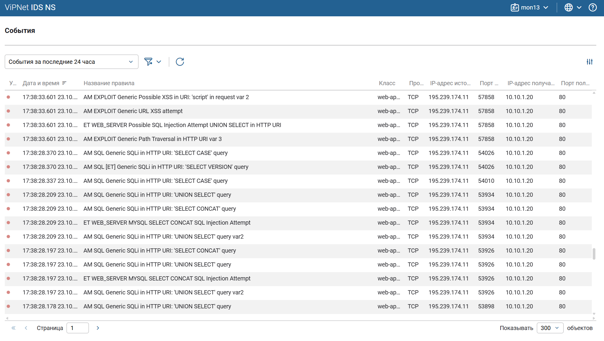{#fig:001 width=90%}

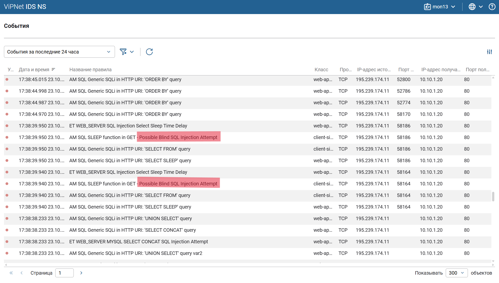{#fig:002 width=90%}

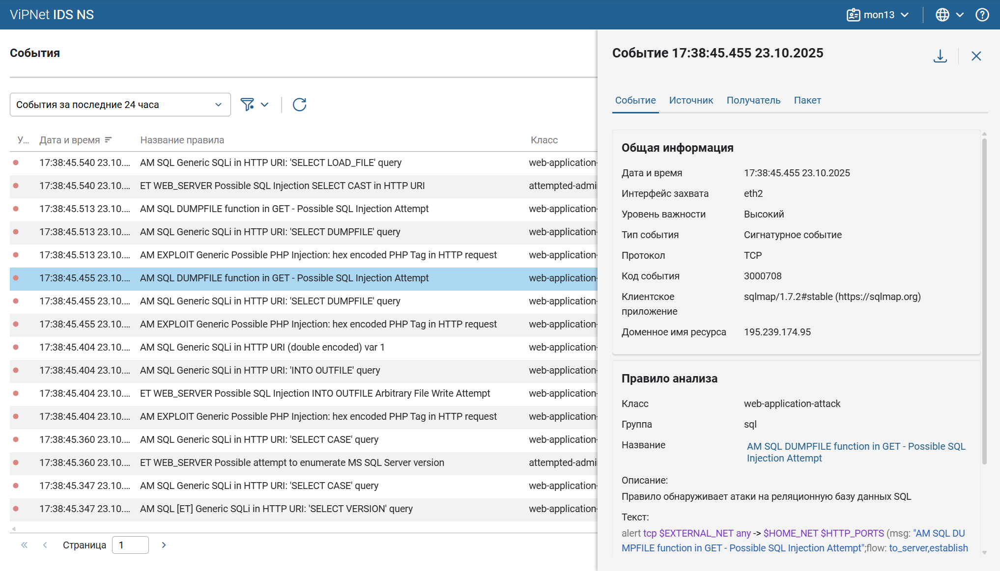{#fig:003 width=90%}

Заполним карточку первого инцидента(рис. [-@fig:004]).

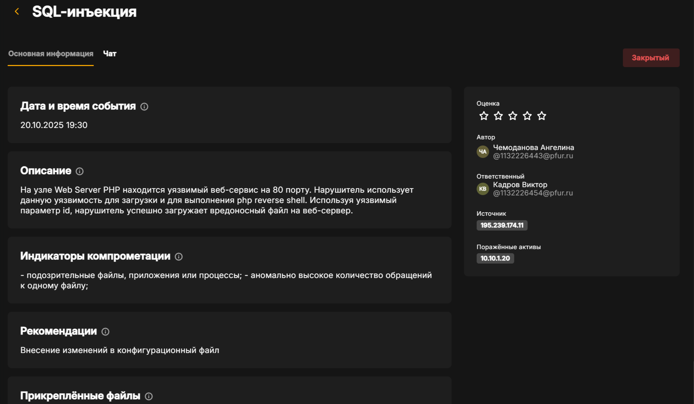{#fig:004 width=90%}

### Устранение уязвимости "SQL-инъекция"

Решение: известно, что $id является уязвимым параметром, следует проверять тип данного параметра. Требуется найти место кода, где данный параметр считывается из GET запроса (рис. [-@fig:005]). 

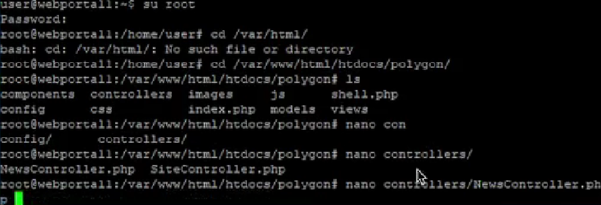{#fig:005 width=90%}

Считывание параметра сайта происходит в функции actionView() в файле NewsController.php (рис. [-@fig:006]). 

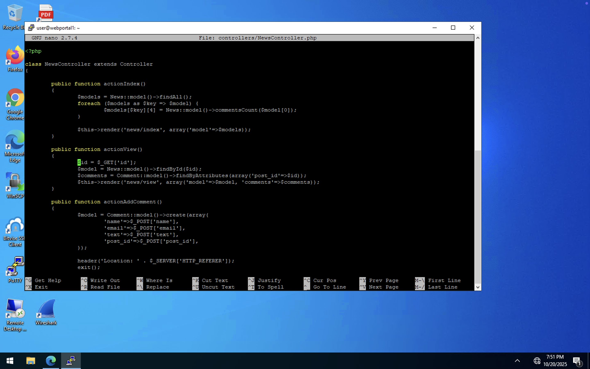{#fig:006 width=90%}

Для проверки типа $id используется функция is_numeric, которая возвращает True в случае, если $id – число, иначе – False. В случае успешной проверки параметр $id будет передаваться в запрос, иначе – запрос будет статичным и независимым от $id (рис. [-@fig:007]). 

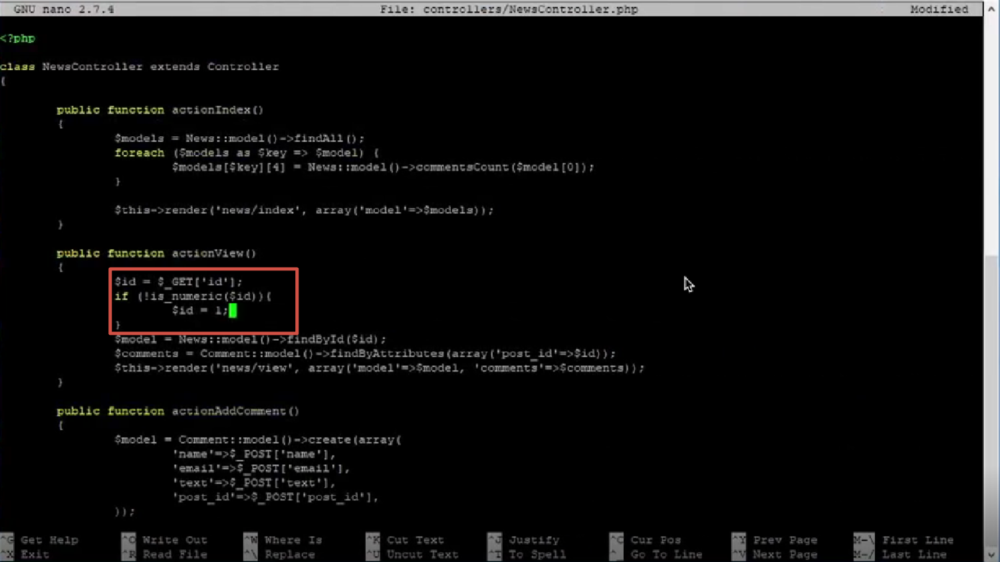{#fig:007 width=90%}

После внесения изменений в файл конфигурации и проверки значения параметра $id уязвимость SQL-инъекции успешно устранена[@met].

### Последствие Web portal meterpreter 

Нарушитель устанавливает shell сессию с веб-порталом PHP. Для обнаружения последствия необходимо проверить сокеты уязвимой машины при помощи утилиты ss с ключами –tp(рис. [-@fig:008]). 

На скриншоте изображено активное соединение веб-портала с IP-адресом нарушителя (195.239.174.11). Необходимо устранить соединение, воспользовавшись командой kill (рис. [-@fig:008]).

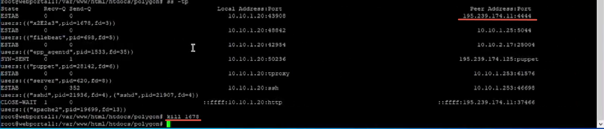{#fig:008 width=90%}

В результате выполнения команды сессия с нарушителем завершена, последствие Web portal meterpreter успешно устранено[@met]. 

## Второй инцидент

### Обнаружение уязвимости

Один из способов проверки состояния защиты в реальном времени Windows Defender – в Powershell ввести команду Get-MpPreference и проверить значение параметра DisableRealtimeMonitoring. Если значение – True, то защита в реальном времени выключена(рис. [-@fig:009]).

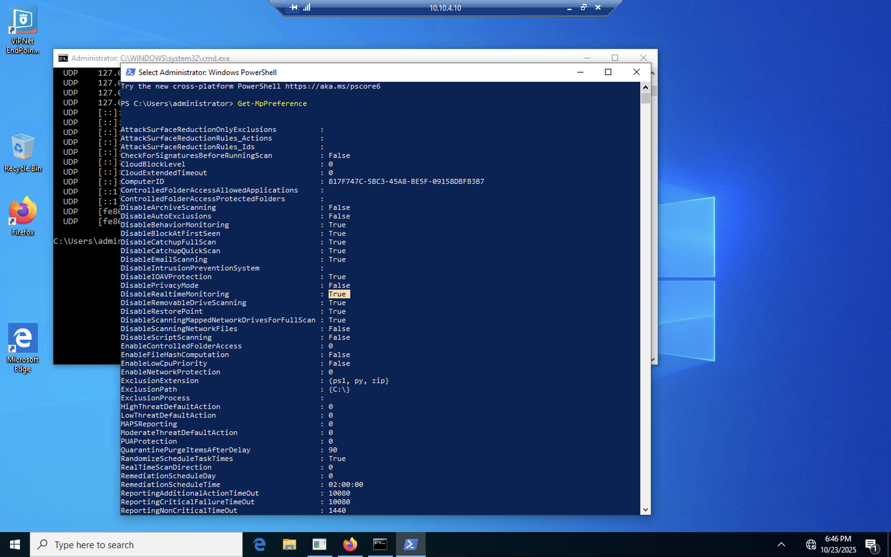{#fig:009 width=90%}

На вышеупомянутом рисунке изображено значение «true» параметра DisableRealtimeMonitoring, что означает отключенную защиту антивируса на узле. 

Заполним карточку второго инцидента(рис. [-@fig:010]).

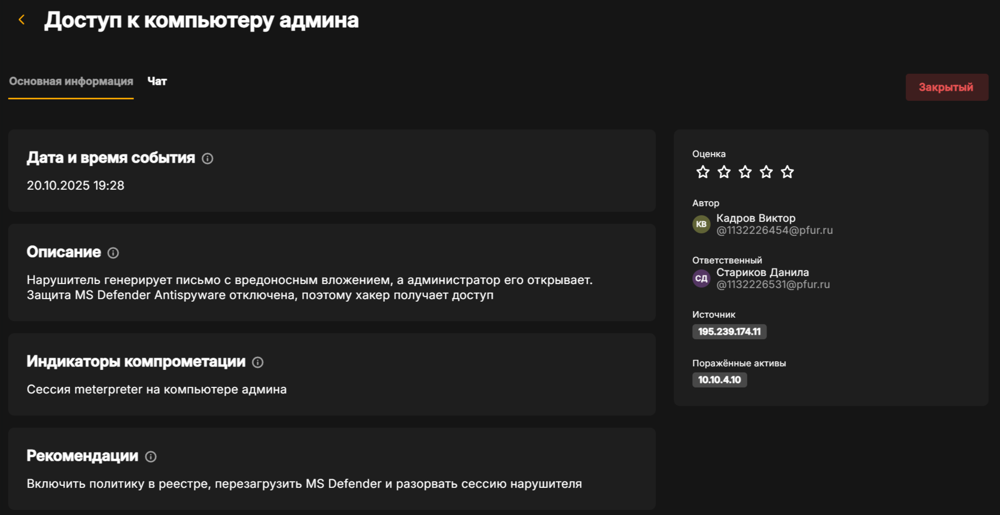{#fig:010 width=90%}

### Устранение уязвимости "Отключенная защита антивируса"

Решение: на узле Administrator Workstation вручную удалить запись в реестре или через консоль, используя команду(рис. [-@fig:011]): REG DELETE «HKLM/SOFTWARE/Policies/Microsoft/Windows Defender» /v DisableAntiSpyware. Подтвердить действие, далее в Windows Defender 
перезапустить Virus & Threat Protection (рис. [-@fig:012]) и включить Real-time Protection (рис. [-@fig:013]).

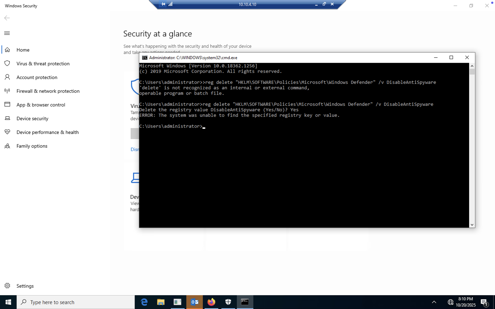{#fig:011 width=90%}

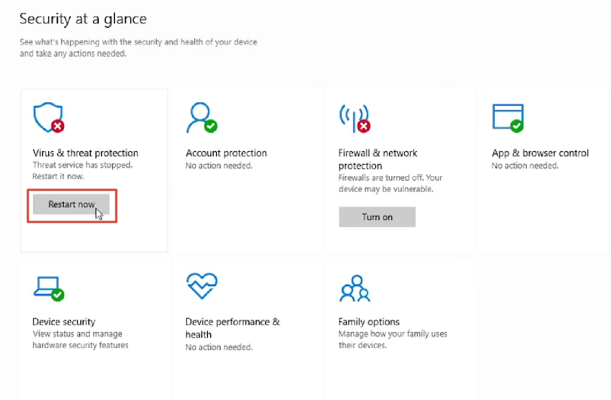{#fig:012 width=90%}

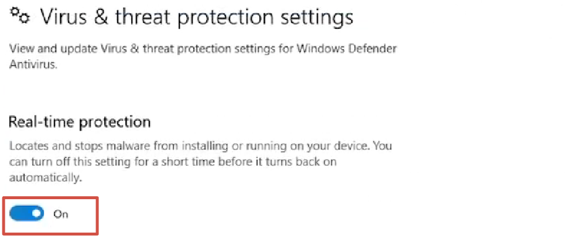{#fig:013 width=90%}

После удаления записи реестра и включения защиты антивирусной программы Microsoft Defender необходимо перезагрузить Windows[@met].

### Последствие Admin meterpreter

Установленную сессию с нарушителем можно обнаружить при помощи утилиты netstat с ключами -ano(рис. [-@fig:014]).

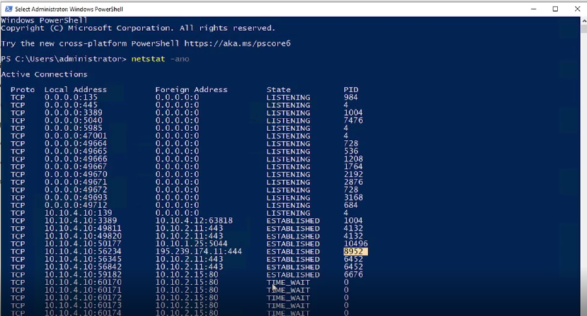{#fig:014 width=90%}

Для устранения необходимо завершить сессию с машиной нарушителя. Например, при помощи команды taskkill /f /pid <PID> (рис. [-@fig:015]).

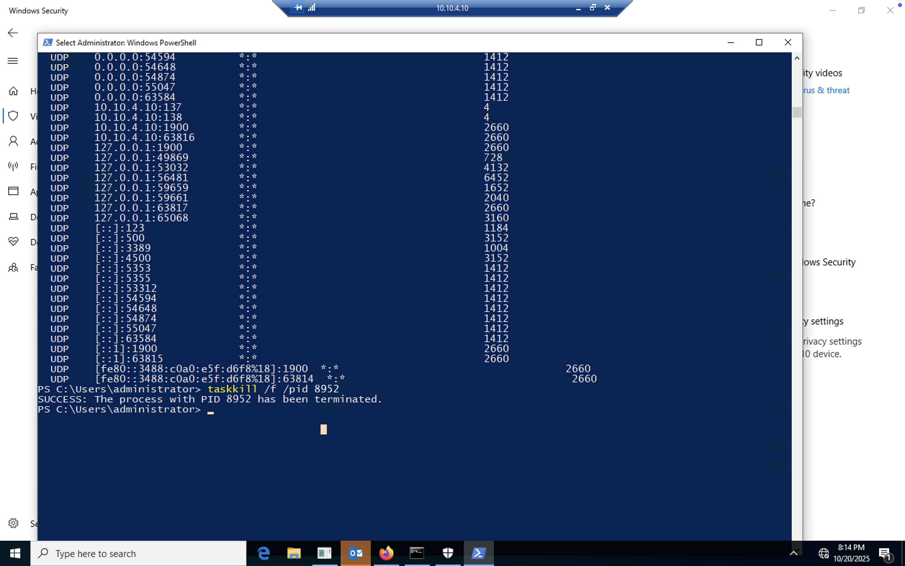{#fig:015 width=90%}

В результате выполнения команды сессия с машиной нарушителя завершена, последствие Admin meterpreter успешно устранено[@met].

## Третий инцидент

### Обнаружение уязвимости

С помощью ViPNet IDS NS[@vip] в сетевом трафике обнаруживаются множественные попытки подключения к хосту AD&DNS с портом 3389, сканирование системы, что может говорить о попытках подбора пароля. Также если мы зайдем на сам узел MS Active Directory, откроем Viewer Properties, перейдем в необходимую директорию с событиями (TerminalServeces...), то сможем увидеть событие с кодом 1149, которое говорит о том, что пользователю удалось подключиться по RDP(рис. [-@fig:016]).

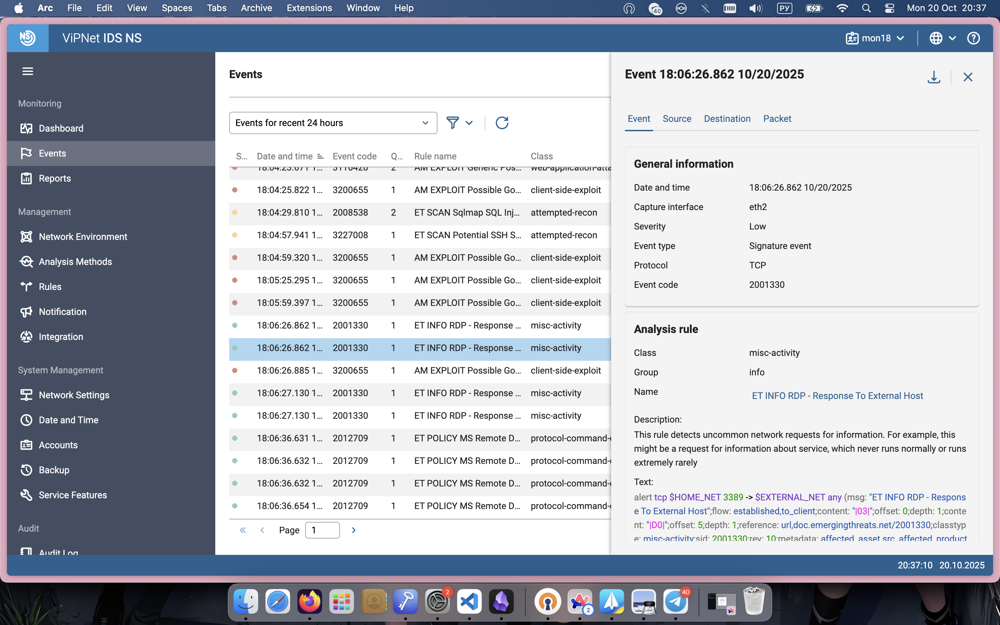{#fig:016 width=90%}

Заполним карточку третьего инцидента(рис. [-@fig:017]).

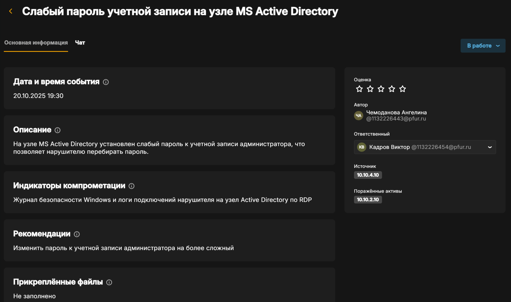{#fig:017 width=90%}

### Устранение уязвимости "Слабый пароль учетной записи"

Решение: изменить пароль к учетной записи администратора на более сложный, не содержащийся в словарях(рис. [-@fig:018]).

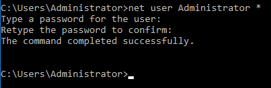{#fig:018 width=90%}

На вышеупомянутом рисунке изображена смена пароля администратора на узле MS Active Directory командой «net user Administrator *». В результате изменения ненадежного пароля уязвимость успешно устранена[@met].

### Последствие AD User 

Добавление нового привилегированного пользователя можно отследить с помощью аудита событий входа в учетную запись Windows security, где появится событие с ID 4720. Необходимо перейти в Event Viewer и в Windows Logs – Security, затем применить фильтр на логи. Ниже показан лог, генерируемый при добавлении нового пользователя(рис. [-@fig:019]).

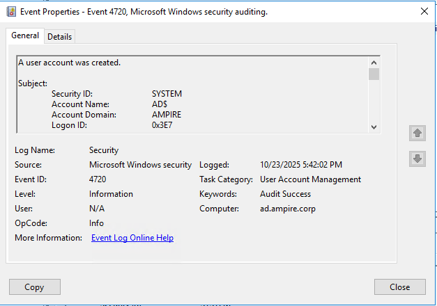{#fig:019 width=90%}

Для удаления пользователя необходимо зайти в Administrative Tools – Active Directory Users and computers. Затем во вкладке Users найти и удалить нового привилегированного пользователя с именем «Hacked»(рис. [-@fig:020] - рис. [-@fig:021]).

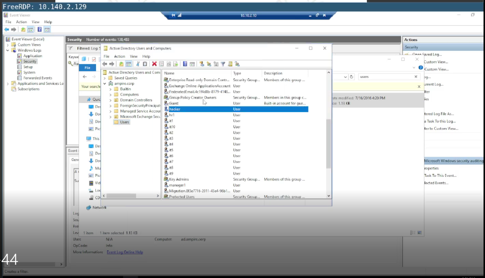{#fig:020 width=90%}

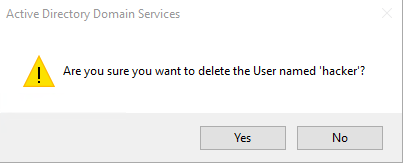{#fig:021 width=90%}

В результате выполнения вышеупомянутых действий привилегированный пользователь удален, последствие AD User успешно устранено[@met]. 

Результат проделанной работы(рис. [-@fig:022]).

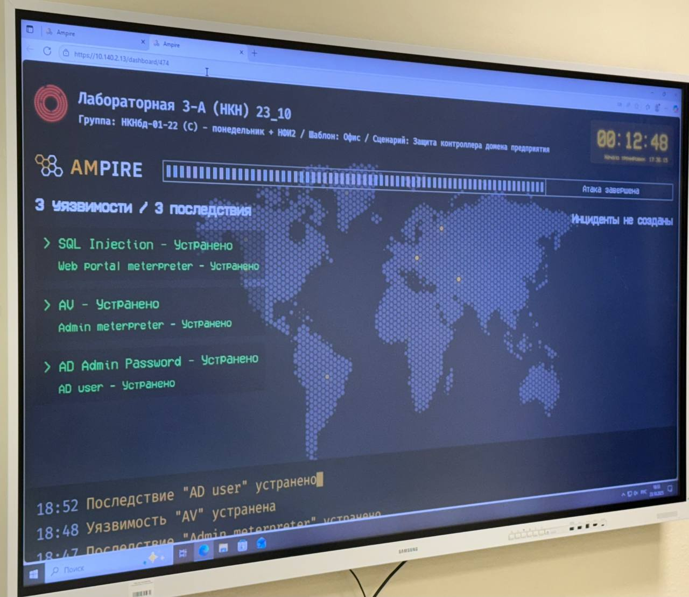{#fig:022 width=90%}

# Вывод

В ходе выполнения данной лабораторной работы мы выполнили тренировку “Защита контроллера домена предприятия” в роли команды “Blue Team” (CSIRT — Computer Security Incident Response Team). В процессе выполнения работы освоили практические навыки выявления, анализа и устранения уязвимостей в различных системах, а также освоили навыки отработки действий по нейтрализации последствий успешных атак.

# Список литературы{.unnumbered}

::: {#refs}
:::

