---
## Front matter
lang: ru-RU
title: Лабораторная работа №5
subtitle: "Кибербезопасность предприятия"
author:

  - НКНбд-01-22;
  - Аристид Жан,
  - Акопян Сатеник,
  - Кадров Виктор,
  - Петров Артем,
  - Нве Манге Хосе Херсон Мико,
  - Эспиноса Висилита Кристина Микаела,
  
  - НПИбд-01-22;
  - Стариков Данила,

  - НФИбд-02-22;
  - Кадрова(Чемоданова) Ангелина

## i18n babel
babel-lang: russian
babel-otherlangs: english

## Formatting pdf
toc: false
toc-title: Содержание
slide_level: 2
aspectratio: 169
section-titles: true
theme: metropolis
header-includes:
 - \metroset{progressbar=frametitle,sectionpage=progressbar,numbering=fraction}
---

## Описание сценария

Во внутреннем сегменте организации необходимо получить доступ к DNS-серверу и найти флаг в одной из DNS-записей. 

Для прохождения данного сценария в первую очередь потребуется активная meterpreter-сессия с узлом в сегменте DMZ. 

Вариант получения meterpreter-сессии с корпоративным сайтом с помощью модуля wp_wpdiscuz_unauthenticated_file_upload представлен на скриншотах. 

## Получение meterpreter-сессии

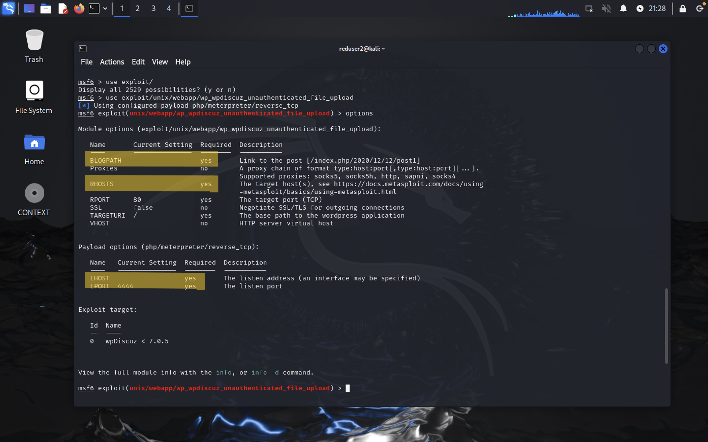{#fig:001 width=75%}

## Получение meterpreter-сессии

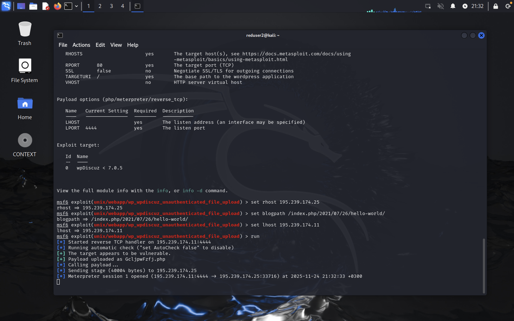{#fig:002 width=75%}

## Получение meterpreter-сессии

Вариант получения meterpreter-сессии с почтовым сервером с помощью модуля exchange_proxyshell_rce представлен на скриншотах. 

## Получение meterpreter-сессии

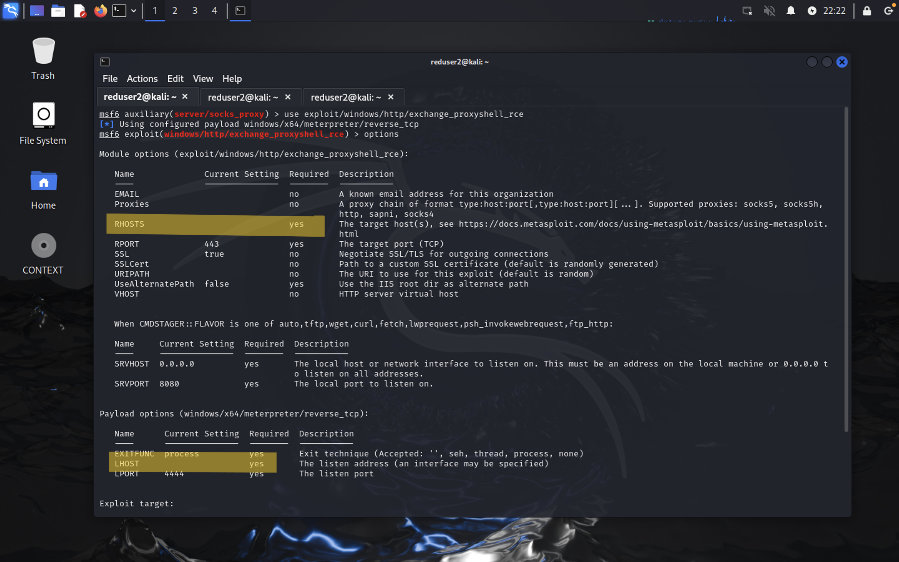{#fig:003 width=75%}

## Получение meterpreter-сессии

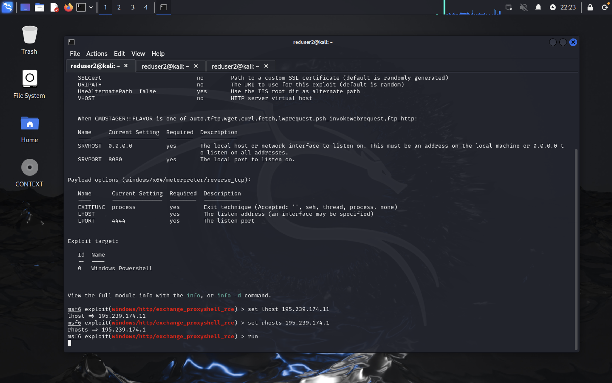{#fig:004 width=75%}

## Поиск DNS-сервера

После получения сессии можно переходить к процедуре поиска нужного сервера. В первую очередь выполнить проброс портов во внутреннююсеть с помощью команды autoroute и запустить данную сеть – run autoroute -s 10.10.10.0/24.

## Поиск DNS-сервера

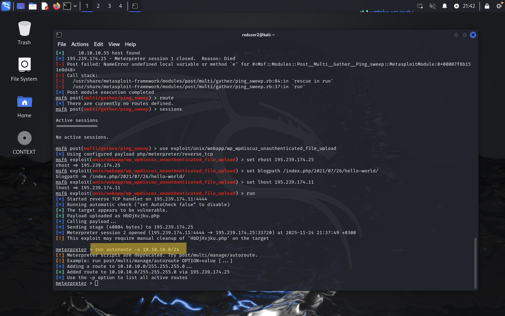{#fig:005 width=75%}

## Поиск DNS-сервера

Свернуть сессию (команда bg) и с помощью модуля multi/gather/ping_sweep сканировать внутреннюю сеть организации для выбора адреса, который может быть использован для дальнейшей атаки. Провести поиск DNS-сервера. 

## Поиск DNS-сервера

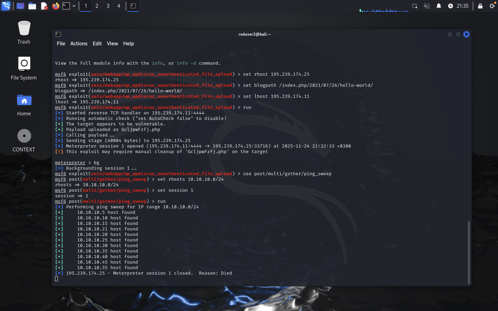{#fig:006 width=75%}

С помощью команды route распечатать маршруты, которые обнаружены Metasploit. 

Далее вернуться в сессию с почтовым сервером (sessions {N}) и отобразить хосты, которые находятся во внутренней сети организации.

## Поиск DNS-сервера

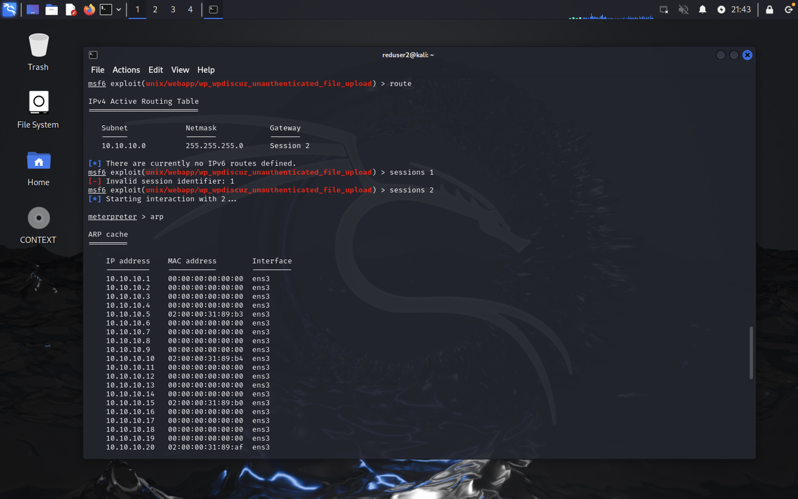{#fig:007 width=75%}

## Поиск DNS-сервера

Проверить наличие открытых портов на хостах, которые находятся во внутренней сети организации, с помощью модуля nmap. Поскольку сканируемые хосты находятся во внутренней сети, в первую очередь необходимо настроить прокси, через который будут проходить все запросы при сканировании. Для этого можно использовать модуль metasploit auxiliary/server/socks_proxy. 

Свернуть сессию (команда bg), далее найти и выбрать модуль metasploit auxiliary/server/socks_proxy. 

## Поиск DNS-сервера

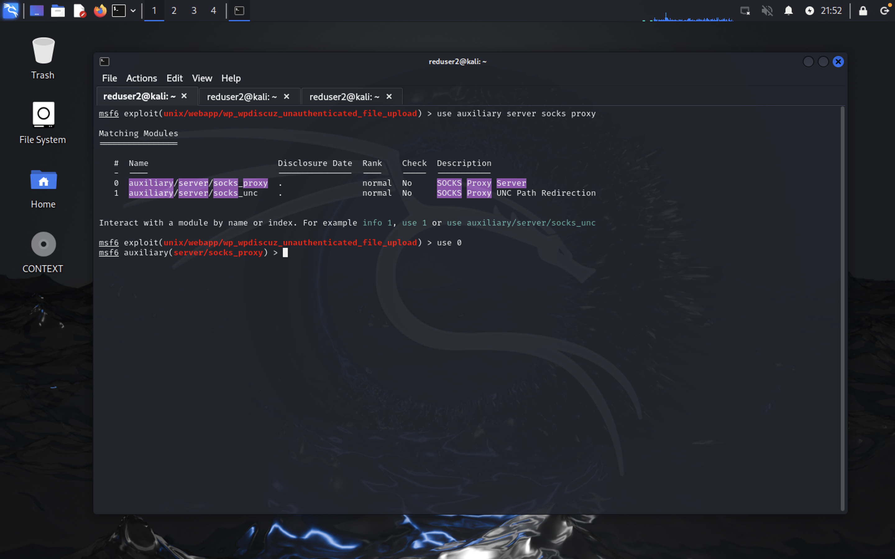{#fig:008 width=75%}

## Поиск DNS-сервера

Настроить модуль в соответствии с параметрами, которые указаны в конфигурационном файле /etc/proxychains.conf.

## Поиск DNS-сервера

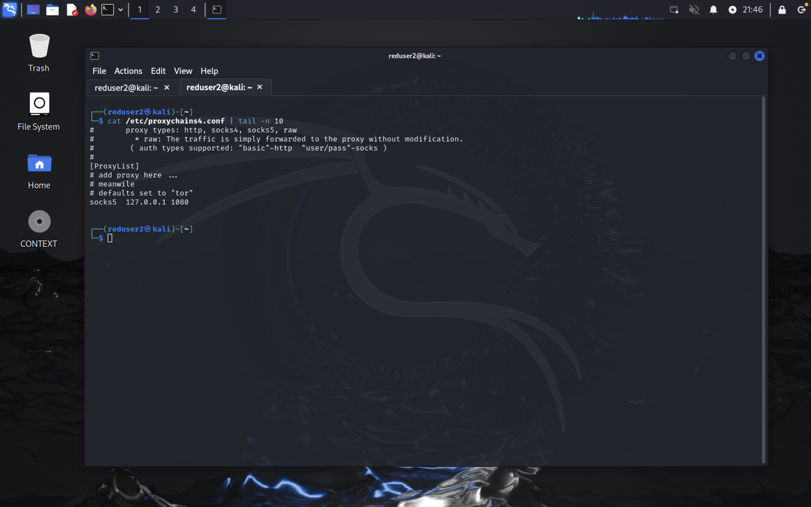{#fig:009 width=75%}

## Поиск DNS-сервера

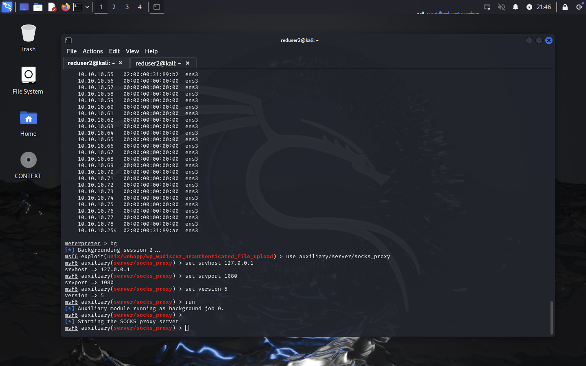{#fig:010 width=75%}

## Поиск DNS-сервера

Далее открыть новый терминал kali. В новом терминале запустить сканирование 100 самых часто используемых портов с помощью команды proxychains nmap –n –sT –Pn --top-ports 100 {IP}. 

В результате сканирования будет получен список открытых портов.

## Поиск DNS-сервера

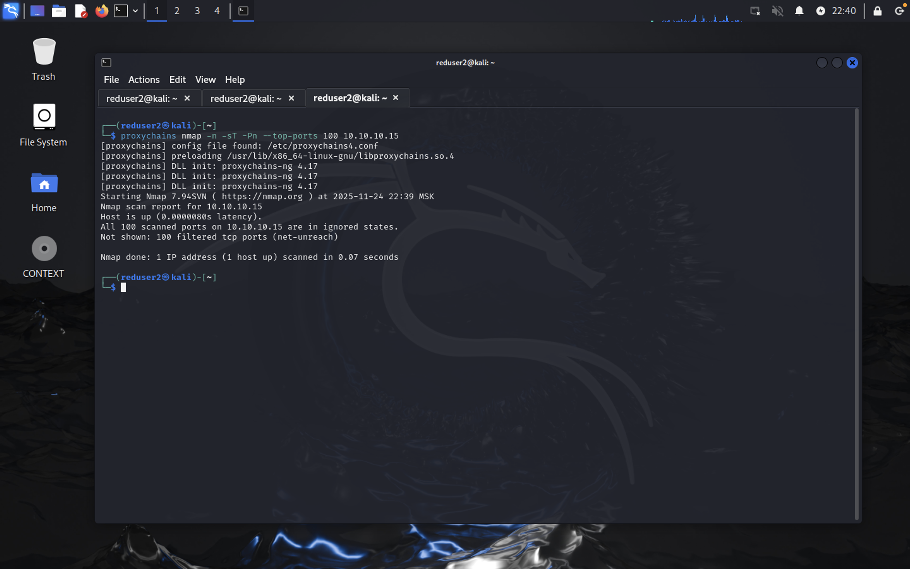{#fig:011 width=75%}

## Поиск DNS-сервера

По стандарту RFC 1035 все DNS-серверы отвечают на порту 53 TCP и UDP. По результатам сканирования можно сделать вывод, что узел 10.10.10.15 является целью атаки – DNS-сервером с открытым 22 портом SSH.

## Поиск DNS-сервера

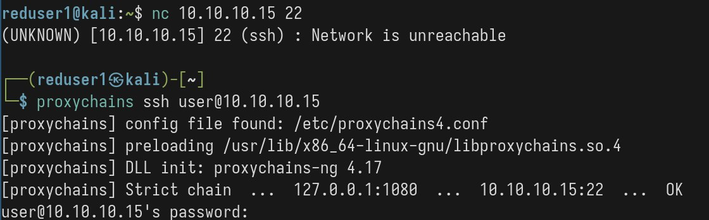{#fig:012 width=90%}

## Bruteforce пароля

В результате сканирования будет получен список открытых портов, в котором обнаружен 22 порт, используемый по умолчанию для подключения по протоколу SSH. 

Для реализации атаки перебором паролей использовать словарь rockyou.txt, который находится по пути /usr/share/wordlists/.

## Bruteforce пароля

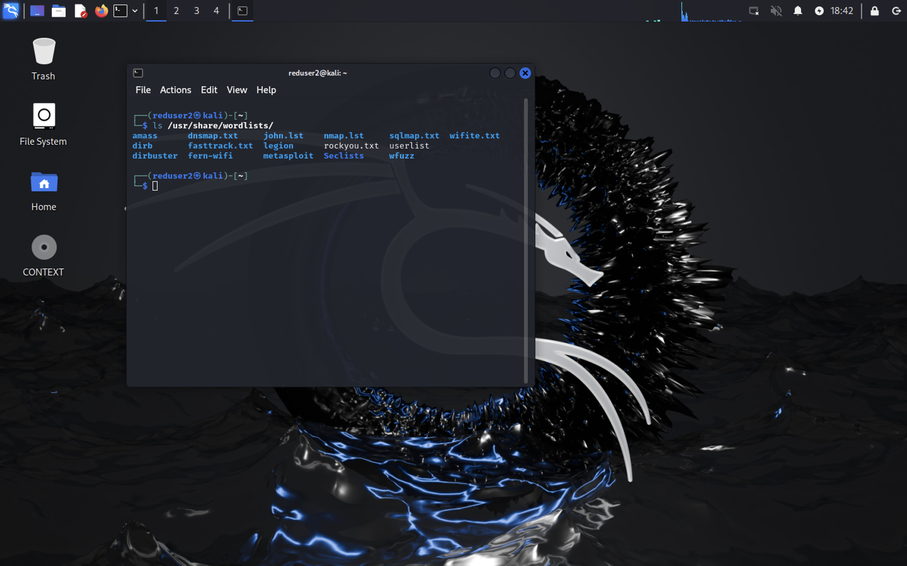{#fig:013 width=75%}

## Bruteforce пароля

Логин пользователя можно получить с помощью файла userlist в директории /usr/share/wordlists с именами пользователей. Выбрать 
пользователя «user», далее запустить утилиту hydra с помощью команды proxychains hydra -V -f -l user -P rockyou.txt -t 32 10.10.10.15 
ssh.

## Bruteforce пароля

{#fig:014 width=75%}

## Bruteforce пароля

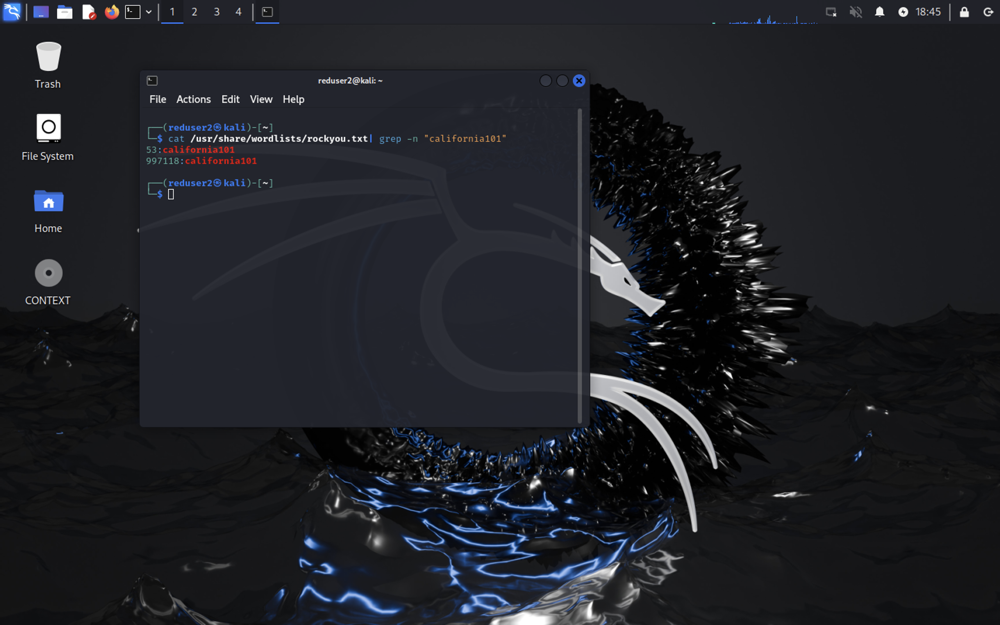{#fig:015 width=75%}

## Bruteforce пароля

Для получения доступа к DNS-серверу можно воспользоваться подключением по SSH по полученным учетным данным или модулем metasploit auxiliary/scanner/ssh/ssh_login с указанием параметров для входа. 

Подключение по SSH по полученным учетным данным осуществляется с помощью команды proxychains ssh user@10.10.10.15. Далее необходимо ввести найденный пароль. 

## Bruteforce пароля

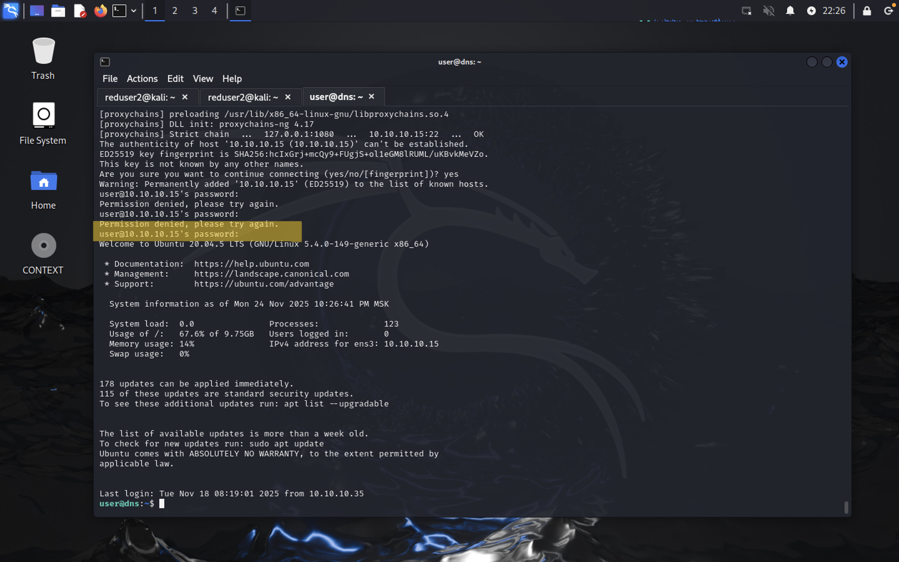{#fig:016 width=75%}

## Bruteforce пароля

Для получения флага необходимо вывести содержимое файла /etc/hosts с помощью команды cat /etc/hosts.

## Bruteforce пароля

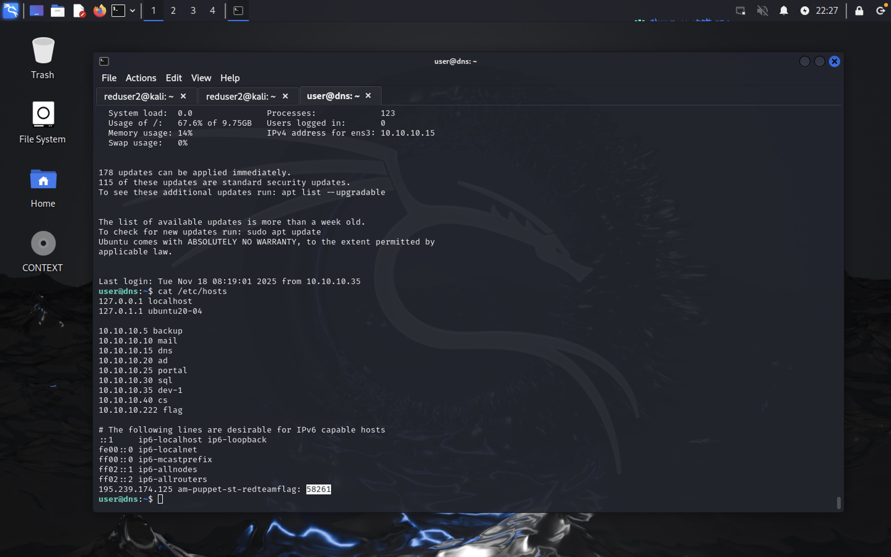{#fig:017 width=75%}

## Bruteforce пароля

Альтернативным вариантом является создание shell-сессии с помощью модуля auxiliary(scanner/ssh/ssh_login). Настройки модуля приведены на скриншоте. После настроек необходимо активировать открытую сессию с помощью команды sessions {N}, где N – номер созданной сессии. 

## Bruteforce пароля

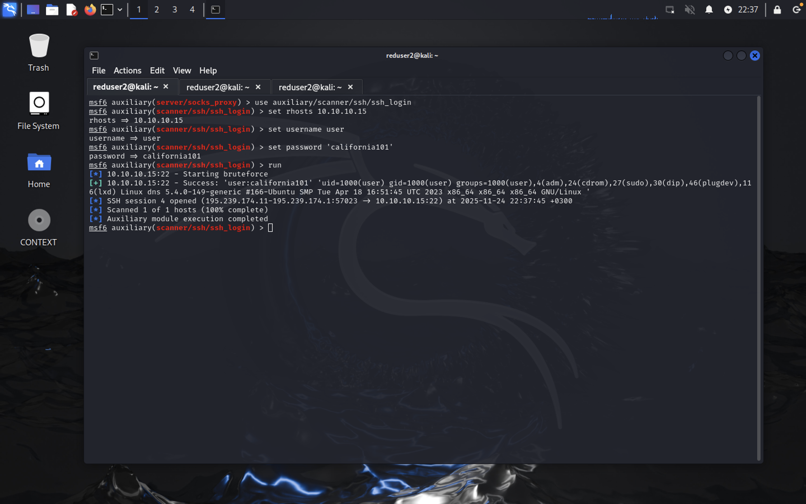{#fig:018 width=75%}

## Bruteforce пароля

После получения сессии необходимо вывести содержимое файла hosts с помощью команды cat. 

## Bruteforce пароля

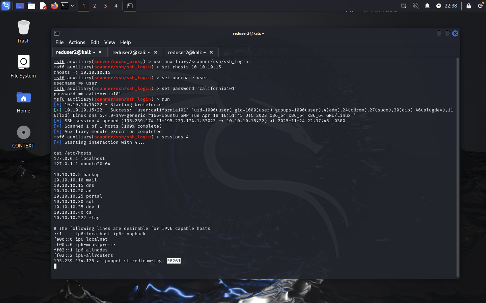{#fig:019 width=75%}

## Вывод

В ходе выполнения данной лабораторной работы мы выполнили тренировку “Захват DNS-сервера”. В процессе выполнения работы освоили практические навыки выявления, анализа и атаки уязвимостей в различных системах.
